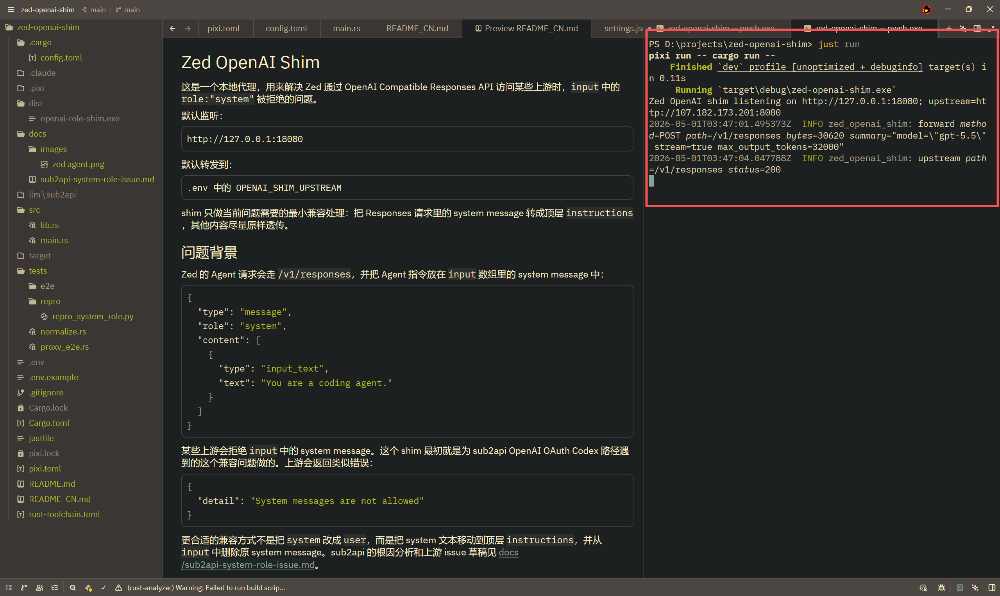
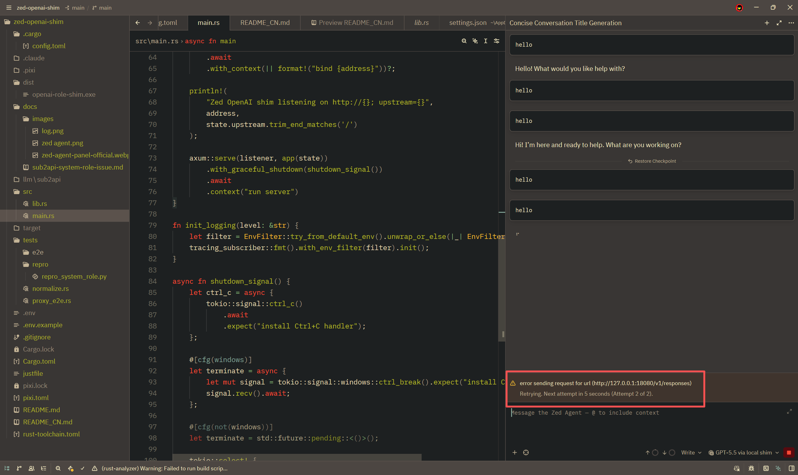

# Zed OpenAI Shim

这是一个本地代理，用来解决 Zed 通过 OpenAI Compatible Responses API 访问某些上游时，`input` 中的 `role:"system"` 被拒绝的问题。

默认监听：

```text
http://127.0.0.1:18080
```

默认转发到：

```text
.env 中的 OPENAI_SHIM_UPSTREAM
```

shim 只做当前问题需要的最小兼容处理：把 Responses 请求里的 system message 转成顶层 `instructions`，其他内容尽量原样透传。

## 概览

- 使用者：下载 release zip，把 `.env` 放到 `zed-openai-shim.exe` 同目录，然后直接运行 exe。
- 开发者：用 `pixi install` 和 `just run` 本地迭代。
- Zed：配置一个 `openai_compatible` provider，`api_url` 指向 `http://127.0.0.1:18080/v1`。

## 问题背景

Zed 的 Agent 请求会走 `/v1/responses`，并把 Agent 指令放在 `input` 数组里的 system message 中：

```json
{
  "type": "message",
  "role": "system",
  "content": [
    {
      "type": "input_text",
      "text": "You are a coding agent."
    }
  ]
}
```

某些上游会拒绝 `input` 中的 system message。这个 shim 最初就是为 sub2api OpenAI OAuth Codex 路径遇到的这个兼容问题做的。上游会返回类似错误：

```json
{
  "detail": "System messages are not allowed"
}
```

更合适的兼容方式不是把 `system` 改成 `user`，而是把 system 文本移动到顶层 `instructions`，并从 `input` 中删除原 system message。上游 issue 是 [Wei-Shaw/sub2api#2147](https://github.com/Wei-Shaw/sub2api/issues/2147)，根因分析见 [docs/sub2api-system-role-issue.md](docs/sub2api-system-role-issue.md)。

## Shim 做了什么

对于 JSON 请求，shim 会：

- 查找顶层 `input` 数组里 `role:"system"` 的 item
- 从 `content` 中提取 `type:"input_text"` 或 `type:"text"` 的文本
- 把这些文本 prepend 到顶层 `instructions`
- 从 `input` 中移除原来的 system message
- 尽量保留其他字段、headers、tools、`prompt_cache_key` 和请求路径

转换后的请求形状示例：

```json
{
  "instructions": "You are a coding agent.",
  "input": [
    {
      "type": "message",
      "role": "user",
      "content": [
        {
          "type": "input_text",
          "text": "Hello"
        }
      ]
    }
  ]
}
```

当前 shim 不处理 Chat Completions 转换。现在的范围就是 Zed Responses API 的 role 兼容问题。

## 使用者安装

从 GitHub Releases 下载 `zed-openai-shim-windows-x86_64.zip`，解压后把 `.env.example` 复制成 `.env`。如果希望 release 目录自包含，就把 `.env` 放在 `zed-openai-shim.exe` 同一个目录：

```text
zed-openai-shim/
  zed-openai-shim.exe
  .env.example
  .env
```

exe 会按下面顺序读取 `.env`：

1. `zed-openai-shim.exe` 同目录的 `.env`
2. `%USERPROFILE%\.zed-openai-shim\.env`
3. 当前工作目录的 `.env`

先读取到的值优先，因为 `dotenvy` 不会覆盖已经存在的环境变量。想做便携目录时，把 `.env` 放 exe 同目录；想以后只替换/更新 exe 时，可以把配置放在用户目录的 `%USERPROFILE%\.zed-openai-shim\.env`。

从示例创建 `.env`：

```powershell
Copy-Item .env.example .env
```

或者一次性创建用户目录配置：

```powershell
New-Item -ItemType Directory -Force "$env:USERPROFILE\.zed-openai-shim"
Copy-Item .env.example "$env:USERPROFILE\.zed-openai-shim\.env"
```

然后编辑 `.env`，设置你的上游：

```powershell
OPENAI_SHIM_UPSTREAM=http://your-upstream.example:8080
```

启动 exe：

```powershell
.\zed-openai-shim.exe
```

默认监听 `http://127.0.0.1:18080`，并转发到 `.env` 中的 `OPENAI_SHIM_UPSTREAM`。

如果 Zed 没有传 `Authorization` header，shim 可以从 `.env` 补：

```powershell
OPENAI_SHIM_API_KEY=replace-with-your-api-key
```

如果 Zed 必须填写 key 并发送 dummy `Authorization` header，可以在 `.env` 开启显式覆盖：

```powershell
OPENAI_SHIM_OVERRIDE_AUTHORIZATION=true
```

不要把真实 key 写进仓库。

## 开发者流程

安装 Pixi 管理的 GNU 工具链，并从源码运行：

```powershell
pixi install
just run
```

构建本地 release exe：

```powershell
just build
```

本地构建产物是 `target\release\zed-openai-shim.exe`。

常用命令：

| 命令 | 说明 |
| --- | --- |
| `pixi install` | 安装 Rust 构建需要的 Pixi GNU 工具链。 |
| `just run` | 开发时从源码运行 shim。 |
| `just check` | 运行格式检查、clippy 和 Rust 测试。 |
| `just test-e2e` | 用本地假 upstream 运行 Rust 代理 E2E。 |
| `just repro-system-role` | 可选的真实上游 system-role 诊断脚本。 |
| `just build` | 构建 `target/release/zed-openai-shim.exe`。 |

`just repro-system-role` 不属于 `just check`，它会请求配置的真实上游，并且需要 `OPENAI_SHIM_API_KEY`。

## Release 构建

GitHub Actions 使用和本地一致的 Pixi + Just 路径：`just check` 和 `just build`。Rust toolchain 是 `stable-x86_64-pc-windows-gnu`，Pixi 提供 GNU linker/toolchain。

release workflow 支持手动触发，也会在推送 `v0.1.1` 这种版本 tag 时发布：

```text
zed-openai-shim-windows-x86_64.zip
```

zip 中包含 `zed-openai-shim.exe` 和 `.env.example`。运行前复制 `.env.example` 为 `.env`，编辑后把 `.env` 保持在 exe 同目录。

Release notes 分两步生成：

1. `git-cliff` 根据上一个 tag 之后的 commits 生成确定性的 changelog。
2. `scripts/polish_release_notes.py` 可选调用 Anthropic-compatible 接口，把 changelog 润色成更适合 GitHub Release 的正文。

如果没有配置 `ANTHROPIC_BASE_URL` 或 `ANTHROPIC_API_KEY`，发布会退回到原始 `git-cliff` 输出，不会因为 AI 不可用而失败。

本地预览 release notes：

```powershell
pixi run git-cliff --latest --output dist\release-notes.raw.md
pixi run python scripts\polish_release_notes.py --input dist\release-notes.raw.md --output dist\release-notes.md
```

## Zed 配置参考

在 Zed settings 中配置一个 OpenAI Compatible provider，指向本地 shim。不要把 API key 写进 `settings.json`；Zed 官方推荐通过 Agent 设置 UI 写入系统 keychain，或者使用 provider 对应的环境变量。

```json
{
  "language_models": {
    "openai_compatible": {
      "openai_shim": {
        "api_url": "http://127.0.0.1:18080/v1",
        "available_models": [
          {
            "name": "gpt-5.5",
            "display_name": "GPT-5.5 via local shim",
            "max_tokens": 400000,
            "max_output_tokens": 32000,
            "max_completion_tokens": 32000,
            "capabilities": {
              "tools": true,
              "images": true,
              "parallel_tool_calls": true,
              "prompt_cache_key": true,
              "chat_completions": false
            }
          },
          {
            "name": "gpt-5.4",
            "display_name": "GPT-5.4 via local shim",
            "max_tokens": 400000,
            "max_output_tokens": 32000,
            "max_completion_tokens": 32000,
            "capabilities": {
              "tools": true,
              "images": true,
              "parallel_tool_calls": true,
              "prompt_cache_key": true,
              "chat_completions": false
            }
          },
          {
            "name": "gpt-5.3-codex",
            "display_name": "GPT-5.3 Codex via local shim",
            "max_tokens": 400000,
            "max_output_tokens": 32000,
            "max_completion_tokens": 32000,
            "capabilities": {
              "tools": true,
              "images": true,
              "parallel_tool_calls": true,
              "prompt_cache_key": true,
              "chat_completions": false
            }
          }
        ]
      }
    }
  },
  "agent": {
    "default_model": {
      "provider": "openai_shim",
      "model": "gpt-5.5",
      "enable_thinking": false
    }
  }
}
```

关键点：

- `api_url` 需要以 `/v1` 结尾
- `capabilities.chat_completions` 设为 `false`，让 Zed 使用 `/v1/responses`
- `capabilities.prompt_cache_key` 可以保持 `true`，shim 会保留这个字段
- `agent.default_model.provider` 要和 provider 名称 `openai_shim` 一致

不要把真实上游 URL 或 API key 写进 Zed settings。Zed 只需要指向本地 shim，真实上游信息放在 `.env`。

## Zed Agent 使用效果

启动 release exe，并让 `agent.default_model` 指向 `openai_shim` 后，Zed Agent 就可以通过本地代理使用这些 OpenAI Compatible 模型。


上图展示了 Zed Agent 选择 `GPT-5.5 via local shim`，并通过配置的 provider 收到回复。



日志截图里可以看到 shim 转发 `/v1/responses` 请求，并收到 upstream `200`，说明 Zed Agent 请求确实走了本地代理。

手动验证时，先启动 `zed-openai-shim.exe`，再打开 Zed Agent，选择 `GPT-5.5 via local shim` 或其他 `openai_shim` 下配置的模型并发送请求。shim 应该会打印一条转发 `/v1/responses` 的日志。

后续截图统一放在 `docs/images/`。截图里不要暴露 API key、私有 prompt 或仓库里的敏感信息。

## 已验证行为

`just check` 会覆盖离线测试和 Rust 代理 E2E。真实上游已验证的行为：

- 原始 `input` 中保留 `role:"system"`：上游失败
- 转成 `instructions`：上游返回 200
- 详细 sub2api issue 说明见 [docs/sub2api-system-role-issue.md](docs/sub2api-system-role-issue.md)

## 排错

如果 Zed Agent 显示无法请求 `http://127.0.0.1:18080/v1/responses`，通常是 shim 没有启动，或者监听端口和 Zed 配置不一致。



先在 release 目录启动 exe，然后重试 Agent 请求：

```powershell
.\zed-openai-shim.exe
```

如果改过 `OPENAI_SHIM_PORT`，需要确认 Zed 的 `api_url` 使用同一个端口，并且仍然以 `/v1` 结尾。

## 日志

shim 默认输出日志到 stdout/stderr。

如果需要写文件日志，统一放到：

```text
logs/
```

`logs/` 已经被 git 忽略。

## 上游说明

上游 issue 是 [Wei-Shaw/sub2api#2147](https://github.com/Wei-Shaw/sub2api/issues/2147)，本地分析放在 [docs/sub2api-system-role-issue.md](docs/sub2api-system-role-issue.md)。在上游补齐 Responses `input_text` system content 支持前，这个 shim 仍然提供本地兼容路径。
