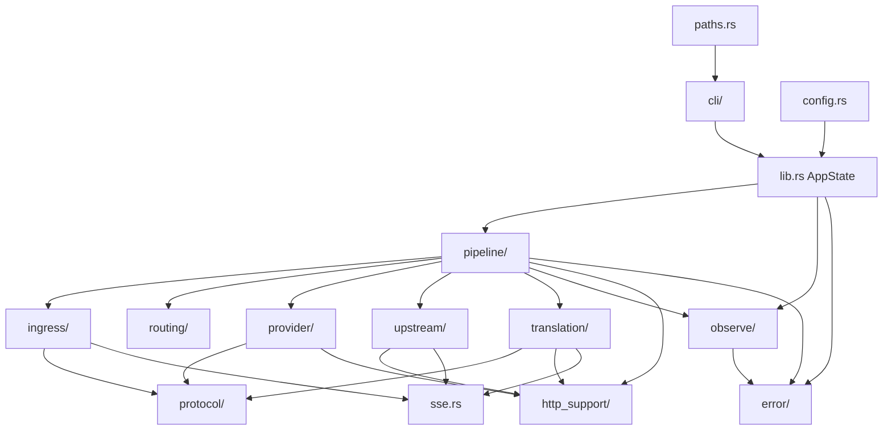

import { FileTree } from '@astrojs/starlight/components';
import { FeatureGrid, ModuleGrid, PipelineStageCards, ProxaiCallout } from '@components/ProxaiDocs.jsx';
import { FlowDiagram } from '@components/FlowDiagram.jsx';

export const proxyFlowNodes = [
  { id: 'client', position: { x: 0, y: 120 }, data: { label: 'Client HTTP request' } },
  { id: 'ingress', position: { x: 230, y: 40 }, data: { label: 'ingress\nparse + normalize' } },
  { id: 'routing', position: { x: 460, y: 40 }, data: { label: 'routing\nroute + provider' } },
  { id: 'requestTranslation', position: { x: 690, y: 40 }, data: { label: 'translation\nrequest payload' } },
  { id: 'providerRequest', position: { x: 920, y: 40 }, data: { label: 'provider/request\nrewrite + serialize' } },
  { id: 'transport', position: { x: 920, y: 200 }, data: { label: 'provider/transport\nsend upstream' } },
  { id: 'upstream', position: { x: 690, y: 200 }, data: { label: 'upstream\nread response' } },
  { id: 'responseTranslation', position: { x: 460, y: 200 }, data: { label: 'translation\nresponse or stream' } },
  { id: 'httpSupport', position: { x: 230, y: 200 }, data: { label: 'http_support\nrebuild response' } },
  { id: 'response', position: { x: 0, y: 200 }, data: { label: 'Client HTTP response' } },
];

export const proxyFlowEdges = [
  { id: 'e1', source: 'client', target: 'ingress', animated: true },
  { id: 'e2', source: 'ingress', target: 'routing', animated: true },
  { id: 'e3', source: 'routing', target: 'requestTranslation', animated: true },
  { id: 'e4', source: 'requestTranslation', target: 'providerRequest', animated: true },
  { id: 'e5', source: 'providerRequest', target: 'transport', animated: true },
  { id: 'e6', source: 'transport', target: 'upstream', animated: true },
  { id: 'e7', source: 'upstream', target: 'responseTranslation', animated: true },
  { id: 'e8', source: 'responseTranslation', target: 'httpSupport', animated: true },
  { id: 'e9', source: 'httpSupport', target: 'response', animated: true },
];

# Architecture

ProxAI is a small local compatibility proxy. It accepts local OpenAI-compatible or Anthropic-style requests, normalizes protocol-specific request shapes, forwards them to a configured upstream provider, and translates upstream responses back to the client-facing protocol when needed.

<ProxaiCallout type="tip" title="Keep it focused">
  ProxAI should stay focused: local compatibility proxy, explicit provider/protocol routing, compact diagnostics, and minimal surprises. It is not intended to grow into a generic multi-tenant AI gateway unless explicitly requested.
</ProxaiCallout>


## Related docs

<FeatureGrid
  items={[
    { title: 'Request lifecycle', href: '/en/developer/architecture/request-lifecycle', icon: 'flow', description: 'Source-level path from inbound request through provider transport to outbound response.' },
    { title: 'Module boundaries', href: '/en/developer/architecture/module-boundaries', icon: 'architecture', description: 'Where parsing, routing, translation, provider behavior, HTTP carriers, errors, and observation belong.' },
    { title: 'Config flow', href: '/en/developer/architecture/config-flow', icon: 'config', description: 'How config.toml, examples, CLI overrides, validation, providers, and runtime state fit together.' },
    { title: 'Error flow', href: '/en/developer/architecture/error-flow', icon: 'alert', description: 'How internal errors become compact client-facing HTTP and SSE errors.' },
    { title: 'Configuration', href: '/en/using/configuration', icon: 'config', description: 'Runtime settings, routes, providers, capture, logging, and errors.' },
    { title: 'Protocol overview', href: '/en/protocol', icon: 'protocol', description: 'Phase axis, protocol axis, and supported runtime paths.' },
    { title: 'Protocol conversion', href: '/en/developer/protocol-conversion', icon: 'flow', description: 'Pair-oriented conversion rules and protocol alignment expectations.' },
  ]}
/>


## Two-axis model

The codebase is easiest to understand as two independent axes.

### Phase axis

The phase axis describes where data is in the proxy pipeline:

- `inbound_request` — the original client request received by ProxAI
- `provider_request` — the request ProxAI prepares for the upstream provider
- `upstream_response` — the response returned by the upstream provider
- `outbound_response` — the response ProxAI returns to the client

### Protocol axis

The protocol axis describes the wire protocol used at a given phase:

- `openai_responses`
- `openai_chat_completions`
- `anthropic_messages`

Each phase has its own protocol:

- `inbound_request.protocol` is what the client sent.
- `provider_request.protocol` is what ProxAI sends upstream, controlled by the selected provider.
- `upstream_response.protocol` is what the provider returns.
- `outbound_response.protocol` is what ProxAI returns to the client.

Provider names are user labels. They are not semantic protocol identifiers.

## Top-level source layout

<FileTree>

- src/
  - main.rs — entry point; delegates to `cli::main`
  - lib.rs — `AppState`, axum `Router`, proxy handler
  - cli/ — CLI parsing and startup
  - config.rs — `config.toml` schema and loading
  - paths.rs — app directory resolution
  - request.rs — shared request carrier types
  - sse.rs — SSE helpers
  - formatting.rs — formatting helpers
  - error/ — domain errors and rendering
  - http_support/ — HTTP carrier helpers
  - ingress/ — inbound protocol parsing and normalization
  - protocol/ — protocol wire types and protocol enums
  - routing/ — route matching
  - provider/ — provider request preparation and HTTP transport
  - upstream/ — upstream response reading
  - translation/ — cross-protocol conversion
  - pipeline/ — typed proxy pipeline
  - observe/ — capture, logging, diagnostics
  - mcp/ — MCP control surface

</FileTree>

## Request lifecycle

`src/lib.rs` registers these routes and sends all of them to the same `proxy` handler:

```text
/v1/responses          /responses
/v1/chat/completions   /chat/completions
/v1/messages           /messages
```

The simplified inbound path is:

```rust
let prepared_provider = inbound_http
    .prepare_inbound()?                  // ingress: parse + normalize
    .route_to_provider(...)?             // routing: choose provider
    .prepare_provider_request()?;        // provider/request + translation

run_provider_flow(prepared_provider).await
```

`run_provider_flow` then handles the provider side:

```rust
let provider_http = prepared_provider
    .send_to_upstream().await?           // provider/transport + upstream
    .handle_upstream_response().await?;  // upstream: read body / stream

provider_http.translate_to_outbound().await?  // translation + http_support
```

<FlowDiagram nodes={proxyFlowNodes} edges={proxyFlowEdges} height={420} client:only="react" />

## Pipeline stages

<PipelineStageCards
  stages={[
    {
      name: 'inbound_request',
      modules: ['pipeline/inbound.rs', 'ingress/'],
      responsibility: 'Read body, detect protocol, normalize request shape, create `InboundHttpFlow`.',
    },
    {
      name: 'Routing',
      codeName: false,
      modules: ['pipeline/inbound.rs', 'routing/'],
      responsibility: 'Match by protocol and model, resolve default provider.',
    },
    {
      name: 'provider_request',
      modules: ['pipeline/provider_request.rs', 'provider/request', 'translation/request'],
      responsibility: 'Translate request payload, rewrite provider model, serialize body.',
    },
    {
      name: 'Send upstream',
      codeName: false,
      modules: ['pipeline/provider_request.rs', 'provider/transport'],
      responsibility: 'Build auth headers, construct upstream URL, send via `reqwest`.',
    },
    {
      name: 'upstream_response',
      modules: ['pipeline/upstream_response.rs', 'upstream/'],
      responsibility: 'Read status, headers, and body or stream.',
    },
    {
      name: 'outbound_response',
      modules: ['pipeline/provider_response.rs', 'translation/response', 'translation/streaming'],
      responsibility: 'Translate response back to inbound protocol and rebuild HTTP response.',
    },
  ]}
/>

`pipeline/` uses a typed `ProxyFlow<S>` state machine. Each phase consumes one flow state and returns the next one, keeping the phase order explicit.

## Module responsibility map

<ModuleGrid
  modules={[
    { name: 'protocol/', icon: 'protocol', description: 'Protocol wire shapes and shared protocol enums. Models JSON only; no conversion and no HTTP carrier types.' },
    { name: 'ingress/', icon: 'route', description: 'Inbound protocol detection, parsing, and normalization before routing and translation.' },
    { name: 'routing/', icon: 'flow', description: 'Provider selection from request protocol, model pattern, defaults, and route configuration.' },
    { name: 'translation/', icon: 'protocol', description: 'Pure request, response, and streaming conversion across explicit protocol pairs.' },
    { name: 'provider/', icon: 'key', description: 'Provider request rendering, model rewrite, auth headers, upstream URL construction, and transport.' },
    { name: 'upstream/', icon: 'terminal', description: 'Reading upstream status, headers, complete bodies, or streaming byte carriers.' },
    { name: 'http_support/', icon: 'file', description: 'Protocol-neutral HTTP helpers such as content-type checks, response reconstruction, and boxed streams.' },
    { name: 'observe/', icon: 'gauge', description: 'Capture artifacts, structured logging, request hints, and privacy-preserving diagnostics.' },
    { name: 'error/', icon: 'alert', description: 'Domain-specific error types and client-facing response rendering.' },
  ]}
/>

## Boundary rules

- `protocol/` is low-level wire modeling: JSON shapes only, no conversion.
- `pipeline/` coordinates the full request lifecycle and owns phase order.
- `translation/` is pure at the HTTP carrier boundary: it accepts protocol values and payload/stream carriers, not HTTP `Response`/`Body` or provider-private structs.
- `provider/` owns provider request rendering and transport details such as auth headers, upstream URLs, and idle-read timeout.
- `observe/` cuts across the pipeline for diagnostics, but does not make routing or protocol decisions.
- Semantic stream and HTTP errors should use domain errors instead of being hidden inside `std::io::Error`.

## Dependency direction



Key rules:

- `protocol/` is low-level wire modeling.
- `pipeline/` is the coordinator that knows about the full request lifecycle.
- `translation/` does not depend on HTTP `Response`/`Body` or provider-private types.
- `observe/` cuts across the pipeline but does not make protocol or routing decisions.

## Translation selection

Translation is selected from two protocol values:

- inbound `request_protocol`, detected by `ingress/`
- provider `protocol`, configured on the selected provider

Rules:

- Same protocol: pass through without protocol conversion.
- Different protocols: dispatch to `translation/<inbound_protocol>/to_<provider_protocol>/`.
- Unsupported pairs fail explicitly.

## Data type conventions

- Prefer top-level enums keyed by protocol for protocol-specific request/response data.
- Avoid parallel `protocol` / `payload` / `projection` / `summary` fields that can drift into impossible states.
- Keep streams as `ByteStream` across HTTP carrier boundaries.
- Keep provider names separate from protocol names.
