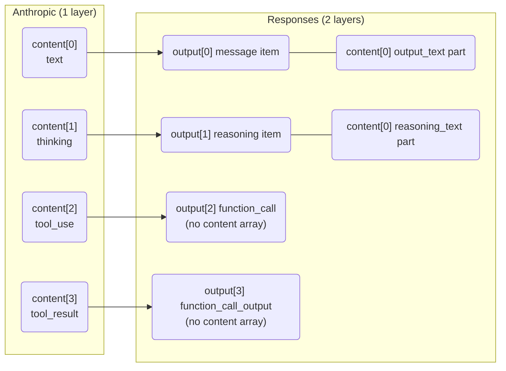

import { ConversionPath, FeatureGrid, ProtocolCompare, ProxaiCallout } from '@components/ProxaiDocs.jsx';
import { FlowDiagram } from '@components/FlowDiagram.jsx';
import { JsonExample } from '@components/JsonExample.jsx';

# Streaming Identifiers

## Streaming identifier model and parallel assembly

When a model emits multiple content blocks in parallel (most commonly two
interleaved tool calls), each protocol needs a stable way to attach each
delta event to the correct in-flight block. The three supported protocols use
**different identifier models** for this, and the differences explain why
ProxAI's streaming translators carry the bookkeeping fields they do.

The example below is the same logical response in all three protocols: a short
preface text, followed by two tool calls whose argument deltas arrive
interleaved.

### Anthropic Messages: per-stream `index`

Anthropic uses an integer `index` on every `content_block_*` event. The index
is the block's position in the response `content` array, assigned by the
upstream in arrival order, and is only meaningful inside the SSE stream that
produced it. There is **no** stable cross-request string identifier on most
blocks. The exception is `tool_use`, which carries an `id` (e.g. `toolu_abc`)
because `tool_result` blocks in a later turn must reference it.

```text
event: content_block_start
data: {"index":0, "content_block":{"type":"text","text":""}}

event: content_block_start
data: {"index":1, "content_block":{"type":"tool_use","id":"toolu_a","name":"get_weather","input":{}}}

event: content_block_start
data: {"index":2, "content_block":{"type":"tool_use","id":"toolu_b","name":"get_time","input":{}}}

event: content_block_delta
data: {"index":0, "delta":{"type":"text_delta","text":"Looking up"}}

event: content_block_delta
data: {"index":1, "delta":{"type":"input_json_delta","partial_json":"{\"city\":"}}

event: content_block_delta
data: {"index":2, "delta":{"type":"input_json_delta","partial_json":"{\"tz\":"}}

event: content_block_delta
data: {"index":1, "delta":{"type":"input_json_delta","partial_json":"\"Beijing\"}"}}

event: content_block_delta
data: {"index":2, "delta":{"type":"input_json_delta","partial_json":"\"Asia/Shanghai\"}"}}

event: content_block_stop
data: {"index":0}
event: content_block_stop
data: {"index":1}
event: content_block_stop
data: {"index":2}
```

ProxAI keys open blocks in a `BTreeMap<u32, StreamBlock>`. Any inconsistency
(duplicate start, orphan delta, stop without start, delta whose payload type
does not match the started block type) becomes a `StreamTranslationError::Semantic`.

A minimal client assembles the same stream by keying on `index`:

```python
import json
from dataclasses import dataclass, field

events = [
    ("content_block_start",  {"index": 0, "content_block": {"type": "text", "text": ""}}),
    ("content_block_start",  {"index": 1, "content_block": {"type": "tool_use", "id": "toolu_a", "name": "get_weather", "input": {}}}),
    ("content_block_start",  {"index": 2, "content_block": {"type": "tool_use", "id": "toolu_b", "name": "get_time",   "input": {}}}),
    ("content_block_delta",  {"index": 0, "delta": {"type": "text_delta",       "text": "Looking up"}}),
    ("content_block_delta",  {"index": 1, "delta": {"type": "input_json_delta", "partial_json": "{\"city\":"}}),
    ("content_block_delta",  {"index": 2, "delta": {"type": "input_json_delta", "partial_json": "{\"tz\":"}}),
    ("content_block_delta",  {"index": 1, "delta": {"type": "input_json_delta", "partial_json": "\"Beijing\"}"}}),
    ("content_block_delta",  {"index": 2, "delta": {"type": "input_json_delta", "partial_json": "\"Asia/Shanghai\"}"}}),
    ("content_block_stop",   {"index": 0}),
    ("content_block_stop",   {"index": 1}),
    ("content_block_stop",   {"index": 2}),
]

@dataclass
class Block:
    type: str
    text: str = ""
    id: str | None = None
    name: str | None = None
    arguments: str = ""

open_blocks: dict[int, Block] = {}
finished: list[Block] = []

for event_type, data in events:
    idx = data["index"]
    if event_type == "content_block_start":
        cb = data["content_block"]
        open_blocks[idx] = Block(type=cb["type"], id=cb.get("id"), name=cb.get("name"))
    elif event_type == "content_block_delta":
        delta = data["delta"]
        block = open_blocks[idx]
        if delta["type"] == "text_delta":
            block.text += delta["text"]
        elif delta["type"] == "input_json_delta":
            block.arguments += delta["partial_json"]
    elif event_type == "content_block_stop":
        finished.append(open_blocks.pop(idx))

for b in finished:
    if b.type == "text":
        print(f"TEXT: {b.text!r}")
    elif b.type == "tool_use":
        print(f"TOOL_CALL: name={b.name!r} arguments={b.arguments}")
```

> The `index` field is the only join key. Nothing about a block survives outside the stream that produced it — a future `messages` round-trip would have to repeat the full content array.


### OpenAI Responses: global `item_id` + event `sequence_number`

Responses events carry a per-event monotonic `sequence_number: u64` (lets the
client detect lost or out-of-order events) **and** a per-item string `item_id`
that is stable across requests, snapshots, and `previous_response_id` chains.
`output_index: u32` is also present but is a convenience locator, not the
primary identifier.

```text
event: response.output_item.added
data: {"sequence_number":2, "output_index":0,
       "item":{"type":"message","id":"msg_1","status":"in_progress","content":[]}}

event: response.output_text.delta
data: {"sequence_number":3, "item_id":"msg_1", "output_index":0, "delta":"Looking up"}

event: response.output_item.added
data: {"sequence_number":4, "output_index":1,
       "item":{"type":"function_call","id":"fc_a","call_id":"call_a",
               "name":"get_weather","arguments":""}}

event: response.output_item.added
data: {"sequence_number":5, "output_index":2,
       "item":{"type":"function_call","id":"fc_b","call_id":"call_b",
               "name":"get_time","arguments":""}}

event: response.function_call_arguments.delta
data: {"sequence_number":6, "item_id":"fc_a", "output_index":1, "delta":"{\"city\":"}

event: response.function_call_arguments.delta
data: {"sequence_number":7, "item_id":"fc_b", "output_index":2, "delta":"{\"tz\":"}

event: response.function_call_arguments.delta
data: {"sequence_number":8, "item_id":"fc_a", "output_index":1, "delta":"\"Beijing\"}"}

event: response.function_call_arguments.delta
data: {"sequence_number":9, "item_id":"fc_b", "output_index":2, "delta":"\"Asia/Shanghai\"}"}
```

Responses clients can join deltas back to items by `item_id` alone; the
`sequence_number` is independent ordering metadata, not part of item identity.

A minimal client assembles the same stream by keying on `item_id` and using
`sequence_number` only for sanity checks:

```python
import json
from dataclasses import dataclass, field

events = [
    {"sequence_number": 2, "type": "response.output_item.added",
     "output_index": 0, "item": {"type": "message", "id": "msg_1", "status": "in_progress", "content": []}},
    {"sequence_number": 3, "type": "response.output_text.delta",
     "item_id": "msg_1", "output_index": 0, "delta": "Looking up"},
    {"sequence_number": 4, "type": "response.output_item.added",
     "output_index": 1, "item": {"type": "function_call", "id": "fc_a", "call_id": "call_a",
                                  "name": "get_weather", "arguments": ""}},
    {"sequence_number": 5, "type": "response.output_item.added",
     "output_index": 2, "item": {"type": "function_call", "id": "fc_b", "call_id": "call_b",
                                  "name": "get_time",   "arguments": ""}},
    {"sequence_number": 6, "type": "response.function_call_arguments.delta",
     "item_id": "fc_a", "output_index": 1, "delta": "{\"city\":"},
    {"sequence_number": 7, "type": "response.function_call_arguments.delta",
     "item_id": "fc_b", "output_index": 2, "delta": "{\"tz\":"},
    {"sequence_number": 8, "type": "response.function_call_arguments.delta",
     "item_id": "fc_a", "output_index": 1, "delta": "\"Beijing\"}"},
    {"sequence_number": 9, "type": "response.function_call_arguments.delta",
     "item_id": "fc_b", "output_index": 2, "delta": "\"Asia/Shanghai\"}"},
]

@dataclass
class Item:
    type: str
    id: str
    text: str = ""
    name: str | None = None
    arguments: str = ""

items: dict[str, Item] = {}
expected_seq = None

for ev in events:
    # sequence_number is monotonic per stream; useful for gap detection,
    # but not required for joining deltas to items.
    if expected_seq is not None and ev["sequence_number"] != expected_seq:
        print(f"warning: sequence gap, expected {expected_seq}, got {ev['sequence_number']}")
    expected_seq = ev["sequence_number"] + 1

    if ev["type"] == "response.output_item.added":
        item = ev["item"]
        items[item["id"]] = Item(type=item["type"], id=item["id"], name=item.get("name"))
    elif ev["type"] == "response.output_text.delta":
        items[ev["item_id"]].text += ev["delta"]
    elif ev["type"] == "response.function_call_arguments.delta":
        items[ev["item_id"]].arguments += ev["delta"]

for item in items.values():
    if item.type == "message":
        print(f"TEXT: {item.text!r}")
    elif item.type == "function_call":
        print(f"TOOL_CALL: name={item.name!r} arguments={item.arguments}")
```

> Joining is by `item_id`, not by arrival order, so interleaved deltas for parallel tool calls land in the right item without extra bookkeeping. The same `item_id` would also appear in a later `response.completed` snapshot or a follow-up request using `previous_response_id`.


### OpenAI Chat Completions: per-chunk integer `index`

Chat Completions assigns tool calls an integer `index` inside each streamed
chunk's `tool_calls` array. There is no separate "item added" event; the first
chunk for a tool call also carries its `id` and `name`. Subsequent argument
deltas reuse the same integer `index` to target the same call.

```text
data: {"choices":[{"index":0,"delta":{"role":"assistant","content":"Looking up"}}]}

data: {"choices":[{"index":0,"delta":{"tool_calls":[{
        "index":0,"id":"call_a","type":"function",
        "function":{"name":"get_weather","arguments":""}}]}}]}

data: {"choices":[{"index":0,"delta":{"tool_calls":[{
        "index":1,"id":"call_b","type":"function",
        "function":{"name":"get_time","arguments":""}}]}}]}

data: {"choices":[{"index":0,"delta":{"tool_calls":[{
        "index":0,"function":{"arguments":"{\"city\":"}}]}}]}

data: {"choices":[{"index":0,"delta":{"tool_calls":[{
        "index":1,"function":{"arguments":"{\"tz\":"}}]}}]}

data: {"choices":[{"index":0,"delta":{"tool_calls":[{
        "index":0,"function":{"arguments":"\"Beijing\"}"}}]}}]}

data: {"choices":[{"index":0,"delta":{"tool_calls":[{
        "index":1,"function":{"arguments":"\"Asia/Shanghai\"}"}}]}}]}
```

The Chat `index` is scoped to the tool-call array of one stream, similar in
spirit to Anthropic's per-stream `index` but for tool calls only — Chat has no
stream-level identifier for text or reasoning deltas at all, because their
chunks are not correlated across events by anything other than arrival order.

A minimal client assembles the same stream by keying tool-call deltas on the
inner `tool_calls[].index` and treating text deltas as purely append-only:

```python
import json
from dataclasses import dataclass

chunks = [
    {"choices": [{"index": 0, "delta": {"role": "assistant", "content": "Looking up"}}]},
    {"choices": [{"index": 0, "delta": {"tool_calls": [
        {"index": 0, "id": "call_a", "type": "function",
         "function": {"name": "get_weather", "arguments": ""}}
    ]}}]},
    {"choices": [{"index": 0, "delta": {"tool_calls": [
        {"index": 1, "id": "call_b", "type": "function",
         "function": {"name": "get_time",   "arguments": ""}}
    ]}}]},
    {"choices": [{"index": 0, "delta": {"tool_calls": [
        {"index": 0, "function": {"arguments": "{\"city\":"}}
    ]}}]},
    {"choices": [{"index": 0, "delta": {"tool_calls": [
        {"index": 1, "function": {"arguments": "{\"tz\":"}}
    ]}}]},
    {"choices": [{"index": 0, "delta": {"tool_calls": [
        {"index": 0, "function": {"arguments": "\"Beijing\"}"}}
    ]}}]},
    {"choices": [{"index": 0, "delta": {"tool_calls": [
        {"index": 1, "function": {"arguments": "\"Asia/Shanghai\"}"}}
    ]}}]},
]

text_parts: list[str] = []
tool_calls: dict[int, dict] = {}

for chunk in chunks:
    delta = chunk["choices"][0]["delta"]
    if "content" in delta and delta["content"] is not None:
        text_parts.append(delta["content"])
    for tc in delta.get("tool_calls", []):
        slot = tool_calls.setdefault(tc["index"], {"name": None, "arguments": ""})
        fn = tc.get("function", {})
        if "name" in fn:
            slot["name"] = fn["name"]
        if "arguments" in fn:
            slot["arguments"] += fn["arguments"]

print(f"TEXT: {''.join(text_parts)!r}")
for slot in tool_calls.values():
    print(f"TOOL_CALL: name={slot['name']!r} arguments={slot['arguments']}")
```

> Chat Completions has no `output_item.added` equivalent, so the first appearance of a `tool_calls[].index` also must carry its `id` and `name`. Text and reasoning deltas have no identifier at all — the client simply appends in arrival order, which is why Chat is the weakest fit for reasoning about truly parallel content blocks.


### Why translators must synthesize identifiers

The identifier models do not line up one-to-one, so cross-protocol translation
must allocate the missing side:

<ProtocolCompare
  columns={['Translation direction', 'Upstream gives', 'Target requires', 'What ProxAI does']}
  rows={[
    ['Anthropic -> Responses (text/thinking)', 'only stream-local `index`', 'stable string `item_id`', '`OutputItemIdAllocator` mints item ids derived from the response id'],
    ['Anthropic -> Responses (tool_use)', '`tool_use.id` (`toolu_*`)', 'string `item_id`', 'pass through'],
    ['Anthropic -> Chat (any tool call)', '`tool_use.id` + per-stream `index`', 'per-stream integer `tool_calls[].index` unrelated to upstream index', 'translator maintains `next_tool_call_index` and remembers the mapping per block'],
    ['Responses -> anything', '`item_id` (already stable string)', 'per-stream index or per-stream id', 'derive from output position or pass through'],
  ]}
/>

This is why the two streaming translators hold different bookkeeping state:
`to_openai_responses/streaming.rs` carries `OutputItemIdAllocator` for text and
reasoning blocks, while `to_openai_chat_completions/streaming.rs` carries
`next_tool_call_index` for tool calls. Neither field is decorative — each fills
a real identifier gap that the target protocol mandates and the upstream
protocol does not provide.

> 记住这三点就掌握了 ProxAI 流式翻译的核心动机：
  1. **Anthropic 用 `index`**，**Responses 用 `item_id` + `content_index`**，**Chat 用 `tool_calls[].index`**。
  2. **`index` 只在流内有效**；**`item_id` 跨请求稳定**。
  3. 翻译器必须 **mints** 上游不提供但目标协议要求的 id / index。


### Event granularity: stateless vs snapshot-bound

The identifier difference is one symptom of a deeper split between how Chat
Completions and Responses model streaming. Splitting it out makes the rest of
the translator structure intuitive.

**Both protocols stream incremental content deltas as they arrive.** Text,
tool-call argument fragments, and reasoning text are emitted chunk by chunk
in both translations; nothing about "snapshot vs stateless" changes that.

The split is only about **terminal metadata**: `finish_reason`, `stop_reason`,
`usage`, and the final state of the response as a whole.

**Chat Completions is event-oriented for terminal metadata.** It has
dedicated, self-contained chunk shapes for each piece:

- `choices[].finish_reason` carries the stop reason on a dedicated chunk
- a `choices: []` chunk carries `usage` as an independent update
- `[DONE]` is the bare stream terminator

Each chunk is self-contained: once emitted, the translator never needs its
payload again. Chat has no concept of a "final response snapshot" — once the
`finish_reason` chunk is sent, there is no second chance to revise it.

**Responses is snapshot-oriented for terminal metadata.** There is **no**
standalone `finish_reason` event and **no** standalone `usage` event. Instead,
`stop_reason`, `usage`, `status`, and `incomplete_details` are fields of a
single terminal `response.completed` / `response.incomplete` event, which
embeds the full final `Response` object. The stream is a series of deltas
that progressively construct one `Response`; the terminal event commits it.

This is forced by the Responses wire model, not a translator choice. The
`MessageDelta` event from Anthropic arrives carrying exactly the two pieces
of terminal metadata (`stop_reason` and `usage`) that Responses has no
standalone event for. The translator has nowhere to emit them as independent
updates — they can only live as fields of the eventual snapshot. So during
`MessageDelta` the translator writes them into state and emits nothing.

Concretely, the two translators walk the same Anthropic `MessageDelta` event
but do almost opposite things:

### Chat (event-oriented)

```rust title="to_openai_chat_completions/streaming.rs"
    // Chat: emit everything now, then wait for MessageStop only to send [DONE]
    MessageStreamEvent::MessageDelta(event) => {
        let mut state = self.take_streaming_state()?;
        ...
        chunks.push(chat_finish_chunk(&identity, finish_reason));      // emit
        chunks.push(chat_usage_chunk(&identity, event.usage.into()));  // emit
        self.lifecycle = StreamLifecycle::ReceivedTerminalDelta(state); // state unused after
    }
    MessageStreamEvent::MessageStop(_) => {
        let _state = self.take_terminal_state()?;
        chunks.push(ChatStreamOutput::DoneSentinel);                    // emit [DONE]
    }
```

### Responses (snapshot-bound)

```rust title="to_openai_responses/streaming.rs"
    // Responses: write fields into state, emit nothing yet
    MessageStreamEvent::MessageDelta(event) => {
        let mut state = self.take_streaming_state()?;
        state.input_tokens = ...;             // accumulate
        state.output_tokens = ...;            // accumulate
        state.stop_reason = Some(stop_reason);// accumulate
        self.lifecycle = StreamLifecycle::ReceivedTerminalDelta(state);
    }
    MessageStreamEvent::MessageStop(_) => {
        let state = self.take_terminal_state()?;
        let status = state.terminal_response_status();       // read accumulated
        let response = state.response_snapshot(status);      // read accumulated
        chunks.push(terminal_response_event(status, seq, response));  // emit once
    }
```

Note that for every other Anthropic event (`MessageStart`, `ContentBlockStart`,
`ContentBlockDelta`, `ContentBlockStop`), the Responses translator emits the
corresponding Responses event immediately. Only `MessageDelta` is silent,
because only `MessageDelta`'s payload has no standalone Responses event to
map to. The full Anthropic -> Responses event mapping is:

<ProtocolCompare
  columns={['Anthropic event', 'Responses event(s) emitted']}
  rows={[
    ['`message_start`', '`response.created` (with in-progress snapshot)'],
    ['`content_block_start` (text)', '`response.output_item.added` (message)'],
    ['`content_block_start` (thinking)', '(registered only; first delta emits `reasoning_text.delta`)'],
    ['`content_block_start` (tool_use)', '`response.output_item.added` (function_call)'],
    ['`content_block_delta` (text_delta)', '`response.output_text.delta`'],
    ['`content_block_delta` (thinking_delta)', '`response.reasoning_text.delta`'],
    ['`content_block_delta` (input_json_delta)', '`response.function_call_arguments.delta`'],
    ['`content_block_stop` (text)', '`response.output_text.done`, `response.output_item.done`'],
    ['`content_block_stop` (thinking)', '`response.reasoning_text.done`, `response.output_item.done`'],
    ['`content_block_stop` (tool_use)', '`response.function_call_arguments.done`, `response.output_item.done`'],
    ['`message_delta`', '**none** (writes stop_reason + usage into state)'],
    ['`message_stop`', '`response.completed` or `response.incomplete` (with final snapshot)'],
  ]}
/>

There is also a protocol-safety angle: a Responses client treats
`response.completed` as an irreversible terminal state. Emitting it before
`MessageStop` would mean the client considers the response done while the
upstream SSE stream might still produce events. Aligning the snapshot emit
with `MessageStop` keeps "stream end" and "response complete" in lockstep,
which is the contract clients expect.

This explains the `StreamingState` field difference between the two
translators:

<ProtocolCompare
  columns={['`StreamingState` field', 'In Chat?', 'In Responses?', 'Why']}
  rows={[
    ['`identity`', 'yes', 'yes', 'both protocols echo it on every chunk'],
    ['`output` (representable tracker)', 'yes', 'yes', 'both need to detect empty streams'],
    ['`blocks`', 'yes', 'yes', 'both correlate Anthropic block deltas by index'],
    ['`next_tool_call_index`', 'yes', 'no', 'only Chat assigns integer tool-call indices'],
    ['`item_ids: OutputItemIdAllocator`', 'no', 'yes', 'only Responses requires stable string item ids'],
    ['`stop_reason`', 'no', 'yes', 'Chat emits `finish_reason` immediately; Responses reads it from state for the terminal snapshot'],
    ['`input_tokens` / `output_tokens`', 'no', 'yes', 'Chat emits a usage chunk immediately; Responses reads them from state for the terminal snapshot'],
  ]}
/>

A practical consequence: in Chat, the state held during `ReceivedTerminalDelta`
is effectively dead weight — `take_terminal_state()` returns it and the caller
immediately discards it. In Responses, that state is the whole point —
`response_snapshot()` reads `identity`, `stop_reason`, `input_tokens`, and
`output_tokens` from it to build the terminal event payload. The translator
state machine looks symmetric (`Streaming` -> `ReceivedTerminalDelta` ->
`Stopped`) but the role each state plays is entirely different.

### Per-block state mirrors the protocol split

The same stateless-vs-snapshot split also drives the per-block bookkeeping.
Both translators keep an in-flight `StreamBlock` per Anthropic `content_block`
index, but the two enums carry very different payloads:

### Chat (discriminant + tool index)

```rust title="to_openai_chat_completions/streaming.rs"
    enum StreamBlock {
        Text,
        ToolUse { chat_tool_index: u32 },
        Thinking,
        Ignored,
    }
```

### Responses (full payload for snapshot)

```rust title="to_openai_responses/streaming.rs"
    enum StreamBlock {
        Text { item_id: String, text: String, citations: Option<Vec<TextCitation>> },
        Thinking { item_id: String, text: String },
        RedactedThinking { item_id: String, data: String },
        ToolUse { item_id: String, name: String, arguments: String },
    }
```

Chat only discriminates block kind, plus one integer (`chat_tool_index`) it
has to feed back on every `tool_calls[].index` chunk. The actual content —
text fragments, tool arguments, reasoning text — is emitted chunk by chunk
as it arrives and never needs to be remembered. Chat also has nowhere to
represent redacted thinking or per-item reasoning, so those blocks collapse
into `Ignored`.

Responses accumulates content because each block must eventually produce a
complete `OutputItem` for two downstream consumers: `response.output_item.done`
(carrying the finalized item) and the `response.completed` snapshot's `output`
array. Text needs `text` for the snapshot, `item_id` for every delta/done
event, and `citations` for annotation translation. ToolUse needs accumulated
`arguments` plus `name` and `item_id`. RedactedThinking has no streamed deltas
but must surface its `data` payload as `encrypted_content`.

Field-by-field justification, classified by what consumes each field:

<ProtocolCompare
  columns={['Block kind', 'Field', 'Chat translator', 'Responses translator', 'Notes']}
  rows={[
    ['Text', 'discriminant', 'yes', 'yes', 'delta type validation'],
    ['', '`item_id`', 'no', 'yes', 'Responses mandates `item_id` on every delta/done event; Chat has no item-level id'],
    ['', 'accumulated `text`', 'no', 'yes', 'Responses builds `output_text.done` + snapshot from it; Chat emits deltas immediately'],
    ['', '`citations`', 'no', 'yes', 'Responses `OutputTextContent.annotations`; Chat handles annotations differently'],
    ['Thinking', 'discriminant', 'yes', 'yes', 'delta type validation'],
    ['', '`item_id` / `text`', 'no', 'yes', 'same reason as Text'],
    ['RedactedThk', '`item_id` / `data`', '`Ignored`', 'yes', 'Responses `encrypted_content`; Chat protocol has no reasoning slot, dropped in both streaming and non-streaming'],
    ['ToolUse', 'discriminant', 'yes', 'yes', 'delta type validation'],
    ['', '`chat_tool_index`', 'yes', 'no', 'Chat-only integer index into `tool_calls[]`; Responses uses `item_id`'],
    ['', '`item_id` / `name`', 'no', 'yes', 'Responses needs stable id + name for the done event and snapshot'],
    ['', 'accumulated `args`', 'no', 'yes', 'Responses `function_call_arguments.done` + snapshot'],
  ]}
/>

Every field on both sides has at least one real consumer; nothing is dead
weight, and nothing is missing a field it would actually use. Unifying the
two enums would either add unused fields to Chat or starve Responses of data
it needs. The asymmetry is the protocol split showing through, not a design
defect.

### Concept hierarchy: flat content vs itemized output

The identifier and event-granularity splits both stem from a deeper
structural difference: how the two families of protocols layer content
inside a turn.

Anthropic Messages is **flat**. A single message carries one `content[]`
array, and every block — text, thinking, tool_use, tool_result, image — is a
peer element in that array. There is no inner nesting: a `TextBlock` is just
`{ text, citations }`, a `ThinkingBlock` is just `{ thinking, signature }`.
To locate a streaming delta you need one index, the block's position in
`content[]`.

OpenAI Responses is **itemized**. A response carries an `output[]` array of
items, and many item types *themselves* carry an inner `content[]` array of
parts. A message item contains `OutputText` / `OutputImage` / `OutputAudio`
parts; a reasoning item contains `ReasoningText` parts; a function_call item
has no content array, just `arguments`. To locate a streaming delta you need
two indices: `output_index` (which item) and `content_index` (which part
inside the item).



This is why the Anthropic -> Responses translator hardcodes `content_index: 0`
in every `output_text.delta` and `reasoning_text.delta` event. Each Anthropic
block maps 1:1 to one Responses item with exactly one content part, so there
is no second index to vary. If Anthropic ever introduced a block shape that
mapped to multiple parts inside a single Responses item, the translator would
need to track and emit a real `content_index`; until then, `0` is correct and
not a placeholder.

> [!NOTE]
> In code review, don't mistake `content_index: 0` for a TODO or placeholder.
> It's correct for the current Anthropic wire shape (1 block = 1 part).

#### Why the split exists: conversation protocol vs resource protocol

The layering choice is not arbitrary — it reflects different design intents.

Anthropic treats a message as the atomic unit of a conversation turn. What is
inside the message (text, thinking, tool calls) is the message's private
business; the protocol only promises a stable `message.id` for the whole
message. Crossing turns means repeating the full content array. This is the
model of **email**: each message is an opaque envelope, and you cite the
envelope, not a paragraph inside it. It is simple, linear, and matches how
LLM streaming actually flows (token by token, block by block).

Responses treats the response as a **resource container** and each item as an
independently addressable sub-resource with its own stable id. Items can be
referenced across requests (`previous_response_id` chains),
diffed/patched/replayed by clients, and — crucially — used as anchors for
hosted tools (`web_search_call`, `code_interpreter_call`, `mcp_call`, image
generation) whose state and lifecycle belong at the item level, not buried
inside a message. This is the model of a **file system**: each file has an
inode, and operations cite files, not byte ranges inside a file.

The id-allocation strategies follow from this:

- **Anthropic** assigns ids sparingly — only when an entity must be cited
  across a turn boundary. `tool_use.id` exists because the next turn's
  `tool_result.tool_use_id` has to reference it. Text and thinking blocks
  have no id; if you need to refer to one, you retransmit the array.
- **Responses** assigns ids universally — every item gets one, because every
  item is a potential reference target. The `call_id` on a function call, the
  `item_id` echoed on every delta, the `previous_response_id` chain — all of
  these assume item-level addressability is the rule, not the exception.

Neither choice is strictly better. They optimize for different workloads:

<ProtocolCompare
  columns={['Workload', 'Better fit']}
  rows={[
    ['Single-turn text / tool dialog', 'Anthropic — flat is simpler, streaming is linear'],
    ['Multimodal parts within one item', 'tie — both can express it (Anthropic via block types, Responses via part types)'],
    ['Patching / diffing a single content fragment', 'Responses — item ids make fragments addressable'],
    ['Hosted tools (image gen / code interpreter / MCP)', 'Responses — items are the natural lifecycle container'],
    ['Streaming incremental output', 'Anthropic — one index, no inner nesting'],
    ['Cross-request state recovery', 'Responses — stable item ids survive across calls'],
    ['Client / translator implementation complexity', 'Anthropic — flat content is easier to walk'],
  ]}
/>

#### ProxAI's translation cost

Most of the bugs and the structural complexity in the Anthropic -> Responses
streaming translator come from lifting a flat `content[]` into an itemized
`output[]`. The translator has to:

- mint a stable `item_id` for every text and reasoning block (Anthropic does
  not provide one) — see `OutputItemIdAllocator`;
- maintain an `output_index` counter separate from the Anthropic block index;
- emit `output_item.added` / `output_item.done` pairs to model the item
  lifecycle that the target protocol requires;
- accumulate completed items into an `output_items` vector so the terminal
  `response.completed` snapshot can carry the full output array;
- hardcode `content_index: 0` because the source protocol has no concept of
  multiple parts inside one block.

The reverse direction (Responses -> Anthropic) is mechanically simpler —
flattening `output[]` back into a single `content[]` loses item ids but
preserves semantics. This asymmetry is also why most of the streaming bugs
found in the audit sat on the Anthropic -> Responses side.

> **TL;DR**: Anthropic is a **conversation protocol** (message = envelope,
  content flat inside). Responses is a **resource protocol** (item = file with
  inode, addressable across requests). ProxAI's translation cost is the cost of
  lifting flat content into an itemized resource tree.
