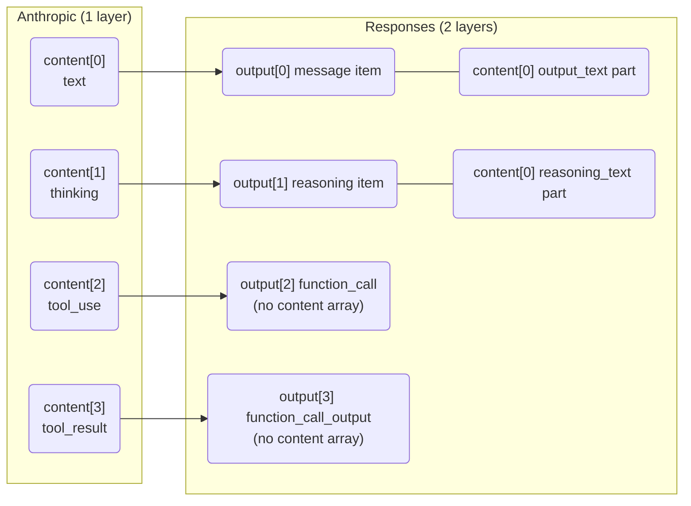

import { ConversionPath, FeatureGrid, ProtocolCompare, ProxaiCallout } from '@components/ProxaiDocs.jsx';
import { JsonExample } from '@components/JsonExample.jsx';

# Protocol Conversion and Wire-Model Alignment

中文版本：[协议转换与 Wire Model 对齐](/zh/protocol-conversion)

ProxAI keeps protocol conversion explicit and pair-oriented. This document records the rules for maintaining wire models, translation code, and SDK-alignment checks.

> 这一份是 ProxAI 最核心的设计文档。理解了这里的「流式标识模型 / 事件粒度 / 概念层级」三块，整个 `src/translation/` 下的代码动机就会一眼清楚。


## Boundaries

- `src/protocol/` owns protocol-specific Rust wire models.
- `src/ingress/` owns inbound parsing and normalization before translation.
- `src/translation/` owns pure cross-protocol conversion between an inbound `request_protocol` and an outbound provider `protocol`.
- `src/provider/request.rs` owns provider request preparation, including model rewrite, projection/summary extraction, and JSON body serialization.
- `src/provider/transport.rs` owns outbound HTTP transport, auth headers, upstream URL construction, and send.
- `src/http_support/` owns HTTP carrier helpers such as `ByteStream`, content-type/header helpers, and response reconstruction.

Do not hide general cross-protocol conversion inside a provider subtree. Provider code may normalize provider-local quirks, but protocol-to-protocol shape changes belong in `src/translation/`.

Translation APIs should stay pure at the carrier boundary:

- request translation: `(request_protocol, provider_protocol, normalized_payload) -> payload`
- non-streaming response translation: `(request_protocol, provider_protocol, payload) -> payload`
- streaming response translation: `(request_protocol, provider_protocol, ByteStream) -> ByteStream`

Do not pass HTTP `Response`, `Body`, provider request structs, or route/model rewrite details into `src/translation/`. This is the carrier-boundary purity required by [Behavior Contract C26](/en/reference/behavior-contracts#translation-purity).

## Naming

Use protocol names for wire behavior:

- `openai_responses`
- `openai_chat_completions`
- `anthropic_messages`

Use pair-oriented conversion module names, for example:

- `openai_responses -> anthropic_messages`
- `anthropic_messages -> openai_responses`

Provider names are user labels and should not be treated as semantic protocol identifiers.

## Two-layer translation model

<ConversionPath
  from={{ title: 'Client protocol', description: 'openai_responses / openai_chat_completions / anthropic_messages' }}
  via={[
    { title: 'Request translation', description: 'ingress -> translation/request -> provider/request' },
    { title: 'Provider', description: 'provider protocol + model rewrite + auth + transport' },
    { title: 'Response translation', description: 'upstream -> translation/response | translation/streaming' },
  ]}
  to={{ title: 'Client protocol', description: 'outbound_response rebuilt via http_support' }}
/>

Each direction is independently translated. ProxAI never round-trips raw provider structures; Anthropic `ToolUseBlock` becomes Responses `FunctionCall`, Anthropic `ThinkingBlock` becomes Responses `ReasoningItem`, and provider-specific metadata such as `signature` or `tool_use_id` is transformed in the process. This implements [Behavior Contract C27](/en/reference/behavior-contracts#translation-purity).

## Routing is not conversion

A route may specify `request_protocol`. If omitted, the route can match any inbound request protocol detected from the actual request path. Provider `protocol` controls the outbound wire format, so route protocol filtering and protocol conversion are separate decisions.

Set `request_protocol` only when the same model pattern needs different routing
for different request endpoints. If a model pattern matches but the explicit
`request_protocol` differs from the inbound request protocol, ProxAI reports a
configuration error instead of silently falling through to a default provider.

## Responses ↔ Anthropic translation architecture

ProxAI sits between the client and the upstream provider, performing two-layer
translation on every request/response cycle:

```
Client ←→ ProxAI ←→ Anthropic
         translation layer
```

```mermaid
graph LR
    Client[Client<br/>Zed / SDK] <--openai_responses / chat / anthropic_messages--> Proxy[ProxAI<br/>translation layer]
    Proxy <--anthropic_messages--> Upstream[Anthropic-compatible upstream]
```

This means the proxy never passes through raw provider structures. Each
direction is independently translated:

- **Request** (client → Anthropic): client's Responses or Chat payload is
  translated into an Anthropic Messages request.
- **Response** (Anthropic → client): Anthropic's message response is translated
  back into a Responses or Chat payload the client understands.

### InputItem: EasyMessage vs Item

Responses `input` accepts `Vec<InputItem>`, where each item can be one of:

<ProtocolCompare
  columns={['Variant', 'Purpose', 'When used']}
  rows={[
    ['EasyInputMessage', 'Simple `role + content` message', 'Client composing new user/developer messages'],
    ['Item', 'Typed output items (function_call, reasoning, etc.)', 'Multi-turn: client echoing back response items from a previous turn'],
    ['ItemReference', 'Reference to a previously returned item by id', 'Multi-turn: referencing items without repeating full content'],
  ]}
/>

**ProxAI's Anthropic translation only produces `EasyInputMessage`.** This is
because Anthropic's `MessageParam` has a simple `role + content` structure with
no concept of echoing back response items. The `Item` variant exists for native
Responses clients that preserve the full response structure across turns.

Example of `Item` usage (native Responses multi-turn, not translated from Anthropic):

<JsonExample data={{
  input: [
    { type: 'message', role: 'user', content: 'search' },
    { type: 'function_call', id: 'fc_1', name: 'lookup', arguments: '{}' },
    { type: 'function_call_output', call_id: 'fc_1', output: 'result' },
  ],
}} />

### Why two-layer translation matters

Response items from Anthropic (`ToolUseBlock`, `ThinkingBlock`, etc.) are
translated into Responses output items (`FunctionCall`, `ReasoningItem`, etc.)
when sent back to the client. The original Anthropic-specific metadata
(`tool_use_id`, `signature`, etc.) is transformed in the process, so the client
cannot round-trip Anthropic structures verbatim. This is by design — ProxAI
guarantees correct translation in both directions, and the client works with
the target protocol's types.

### Reasoning request controls

OpenAI Responses and Anthropic-compatible Messages split reasoning controls
differently:

- Responses `reasoning.effort` maps to Anthropic `output_config.effort` for
  supported effort values (`low`, `medium`, `high`, `xhigh`). This is the
  preferred Anthropic-side effort field.
- Responses `reasoning.summary` (`auto`, `concise`, `detailed`) only maps
  lossily to Anthropic `thinking.display: "summarized"`; Anthropic has no
  equivalent summary granularity.
- Responses `reasoning.summary` without an effort maps to Anthropic
  `thinking: {"type":"adaptive", "display":"summarized"}`.
- Responses `reasoning.effort` plus `reasoning.summary` maps to
  `output_config.effort` plus adaptive `thinking.display`; ProxAI does not
  invent a legacy `thinking.budget_tokens` value.
- Responses `reasoning.effort: "none" | "minimal"` maps to Anthropic
  `thinking: {"type":"disabled"}` because `output_config.effort` has no
  disabled/minimal value.
- Anthropic -> Responses and Anthropic -> Chat request translation accept the
  manual `thinking.type: "enabled"` / `budget_tokens` mode only as a legacy
  compatibility fallback. If `output_config.effort` is absent, ProxAI maps the
  budget lossily to an effort enum and logs a warning; if `output_config.effort`
  is present, it wins and the legacy budget is ignored with a warning.
- Anthropic `thinking.display: "summarized"` maps to Responses
  `reasoning.summary: "auto"`; `display: "omitted"` does not request a
  Responses summary.

## OpenAI Chat ↔ Anthropic Messages message placement

OpenAI Chat Completions and Anthropic Messages both model a conversation as
ordered turns, but they place system instructions, tool calls, and tool results
in different parts of the request body. Keep these placement rules explicit in
translation code.

### High-level placement

<ProtocolCompare
  columns={['Concept', 'OpenAI Chat Completions', 'Anthropic Messages']}
  rows={[
    ['System instructions', '`messages[]` item with `role: "system"`', 'top-level `system` field'],
    ['Developer instructions', '`messages[]` item with `role: "developer"`', 'no dedicated role; fold into top-level `system`'],
    ['User content', '`messages[]` item with `role: "user"`', '`messages[]` item with `role: "user"`'],
    ['Assistant text', '`messages[]` item with `role: "assistant"` and `content`', '`messages[]` item with `role: "assistant"` and text content blocks'],
    ['Tool call request', 'assistant message `tool_calls[]`', 'assistant message content block with `type: "tool_use"`'],
    ['Tool call result', 'separate `messages[]` item with `role: "tool"` and `tool_call_id`', 'user message content block with `type: "tool_result"`'],
    ['Legacy function result', 'separate `messages[]` item with `role: "function"`', 'unsupported; no reliable `tool_result` mapping without `tool_call_id`'],
  ]}
/>

### System and developer instructions

Chat keeps system-like instructions inside the ordered `messages[]` array:

```json
{"role": "system", "content": "You are concise."}
{"role": "developer", "content": "Prefer exact answers."}
```

Anthropic has no `developer` role and does not put system instructions in
`messages[]`. Translate Chat `system` and `developer` content into the top-level
Anthropic `system` field. If there is a single non-empty text part, use the
string form. If there are multiple parts, use the block form to preserve
boundaries:

```json
{
  "system": [
    {"type": "text", "text": "You are concise."},
    {"type": "text", "text": "Prefer exact answers."}
  ]
}
```

### User content

Chat `role: "user"` content does not contain tool results. It contains ordinary
user-provided content parts such as text, images, audio, or files:

```json
{
  "role": "user",
  "content": [
    {"type": "text", "text": "Summarize this."},
    {"type": "image_url", "image_url": {"url": "https://example.test/a.png"}}
  ]
}
```

Translate these into Anthropic user `content` text/image/document blocks where
the target protocol can represent the source. Unsupported user parts should fail
with a `TranslationError::InvalidPayload` rather than being silently dropped.

### Tool call request

In Chat Completions, a model requests tool execution from an assistant message
via `tool_calls[]`:

```json
{
  "role": "assistant",
  "content": "I will look that up.",
  "tool_calls": [
    {
      "id": "call_1",
      "type": "function",
      "function": {
        "name": "lookup",
        "arguments": "{\"query\":\"proxai\"}"
      }
    }
  ]
}
```

In Anthropic Messages, the same request is an assistant content block:

```json
{
  "role": "assistant",
  "content": [
    {"type": "text", "text": "I will look that up."},
    {
      "type": "tool_use",
      "id": "call_1",
      "name": "lookup",
      "input": {"query": "proxai"}
    }
  ]
}
```

Chat function tool arguments are JSON encoded as a string. When translating to
Anthropic `tool_use.input`, parse that string as JSON and fail the conversion if
it is invalid. Do not replace invalid arguments with `{}`.

Chat function tools map to Anthropic custom tools because both carry a named
JSON-schema input contract. Chat custom tools are different: their input is
freeform text or grammar-constrained text, not a JSON object described by
`input_schema`. Reject Chat custom tool definitions, custom tool choices, and
custom tool calls when translating to Anthropic Messages rather than pretending
that they are empty-object JSON tools.

### Tool call result

In Chat Completions, tool execution output is not part of the assistant message.
It is a separate message with `role: "tool"`:

```json
{
  "role": "tool",
  "tool_call_id": "call_1",
  "content": "found"
}
```

In Anthropic Messages, tool results are user-side content blocks that reference
the earlier `tool_use.id`:

```json
{
  "role": "user",
  "content": [
    {
      "type": "tool_result",
      "tool_use_id": "call_1",
      "content": "found",
      "is_error": false
    }
  ]
}
```

This means a Chat `role: "tool"` message translates to an Anthropic
`role: "user"` message containing a `tool_result` block. Do not try to place
Chat tool results inside Chat user content or Anthropic assistant content.

#### Mapping `tool_result.is_error`

Anthropic `tool_result` carries an optional `is_error: bool` to mark a failed
local tool execution. None of the supported target protocols exposes a
matching dedicated failure flag on tool-result output, so the conversion is
lossy by design and follows these rules:

> **Do not map `is_error = true` to `Incomplete`.** `Incomplete` in Responses
  specifically means "output was truncated mid-stream" (e.g. `max_output_tokens`
  hit), not "tool execution failed". Reusing it for failures would mislead
  clients about the result lifecycle. The error context survives in the
  `output` payload text.


- **Anthropic -> OpenAI Responses (`FunctionCallOutputResource.status`)**:
  always `Completed`. The Responses `FunctionCallOutputStatusEnum` has only
  `InProgress` / `Completed` / `Incomplete`, and `Incomplete` specifically
  means "output was truncated mid-stream" — a different semantic from "the
  tool execution failed". Reusing `Incomplete` for failures would mislead
  clients about the result lifecycle. The error context survives in the
  `output` payload: Anthropic clients typically populate `tool_result.content`
  with the error description when `is_error = true`, and that text is passed
  through unchanged. This matches how OpenAI clients and models normally
  distinguish successful vs. failed tool executions.
- **Anthropic -> OpenAI Chat Completions**: Chat `role: "tool"` messages have
  no status or error field at all; only `content` and `tool_call_id`. The
  `is_error` flag is dropped on translation, and any error text in `content`
  is forwarded verbatim. This is symmetric with the Responses path: the error
  signal lives in the payload text, not in protocol metadata.
- **OpenAI Responses / Chat -> Anthropic (`FunctionCallOutput` /
  `role: "tool"` -> `tool_result`)**: proxai currently does not synthesize
  `is_error = true` from any heuristic on the inbound side, because OpenAI
  clients have no canonical way to mark a tool call as failed. If a future
  convention emerges (e.g. an SDK convention for error payloads), revisit
  this direction.

### Legacy function messages

Chat has legacy function-calling shapes in addition to modern `tool_calls`.
Reject `role: "function"` messages when translating to Anthropic Messages.
Legacy function result messages carry a function name but no stable
`tool_call_id`, while Anthropic `tool_result` blocks must reference the earlier
`tool_use.id`. Do not invent an id or downgrade the result into ordinary user
text.

### Response choices and candidate replies

Chat Completions response `choices[]` is a list of alternative candidate
assistant replies, commonly produced by request parameters such as `n`. It is
not a list of content blocks and it is not the representation for parallel tool
calls.

```json
{
  "choices": [
    {"index": 0, "message": {"role": "assistant", "content": "Option A"}},
    {"index": 1, "message": {"role": "assistant", "content": "Option B"}}
  ]
}
```

Parallel tool calls live inside one candidate assistant message as
`choices[i].message.tool_calls[]`; those can map to multiple Anthropic
`tool_use` blocks in a single assistant message.

Anthropic Messages has no equivalent top-level candidate-list response shape. A
non-streaming Anthropic response is one `Message` with one `content[]` sequence,
not a list of alternative assistant messages. OpenAI Responses API also has no
Chat-style `choices[]` equivalent: its `output[]` is a sequence of output items
(message, function call, reasoning item, and so on), not a set of candidate
answers.

Do not merge multiple Chat choices into one Anthropic `content[]` array and do
not silently keep only the first choice. Both approaches lose protocol
semantics: per-choice `index`, independent `finish_reason`, and the fact that
the choices are alternatives rather than one assistant turn. When translating a
Chat response to Anthropic Messages, require exactly one choice and reject
multi-choice responses.

### Chat -> Anthropic response and stream semantics

For non-streaming Chat -> Anthropic response conversion:

- map `choices[0].message.content` to Anthropic `text` blocks;
- map function `tool_calls[]` to Anthropic `tool_use` blocks, parsing Chat
  function `arguments` as JSON for `tool_use.input`;
- when `message.refusal` is present, keep the visible refusal wording as a
  `text` block and also set `stop_reason: "refusal"` with
  `stop_details.explanation`; Chat has no refusal category, so leave it absent;
- require exactly one Chat choice and reject responses without representable
  text, refusal, or function tool calls.

For streaming Chat -> Anthropic conversion, keep an explicit lifecycle:

1. wait for the first assistant choice chunk before emitting Anthropic
   `message_start`;
2. translate Chat `delta.content` / `delta.refusal` into an Anthropic text block;
   the first text fragment may be carried by `content_block_start`, while later
   fragments use `text_delta`;
3. translate Chat function tool-call starts to `tool_use` block starts with an
   empty object `input`, because Chat streaming `function.arguments` are partial
   JSON strings; send those argument fragments as `input_json_delta` events;
4. when Chat `finish_reason` arrives, close all open content blocks and retain a
   pending terminal state containing the finish reason and refusal wording;
5. emit Anthropic `message_delta` / `message_stop` when a later `choices: []`
   usage-only chunk arrives, or when `[DONE]` / EOF ends the stream without final
   usage.

OpenAI's final streaming usage, when requested with
`stream_options: {"include_usage": true}`, is represented by a final
`choices: []` chunk. Treat that usage-only chunk as the source of final usage.
Do not treat `usage` on a non-empty `choices` chunk as final usage and do not use
it to stop the Anthropic stream. Some OpenAI-compatible servers expose
continuous/intermediate usage statistics on ordinary chunks; those values are
not a replacement for the final usage-only chunk and are ignored by this
conversion.

A `choices: []` Chat stream chunk is only valid as a usage-only chunk after a
terminal `finish_reason` has been seen. Reject usage-only chunks before any
assistant message, before a terminal finish reason, or after the Anthropic
message has stopped. Reject Chat stream `logprobs`, non-assistant delta roles,
and multi-choice chunks rather than silently dropping information Anthropic
Messages cannot represent.

### Streaming terminators: Chat `[DONE]` vs Responses terminal events

Keep stream terminators protocol-specific rather than treating all SSE streams
alike.

OpenAI Chat Completions streaming is data-only SSE and is terminated by a
non-JSON sentinel frame:

```text
data: [DONE]
```

The OpenAI/async-openai schema documents Chat streaming as ending with
`data: [DONE]`, and `stream_options.include_usage` sends its final usage-only
chunk before that sentinel. Therefore translators that emit Chat Completions
streams must append `[DONE]` after the terminal finish/usage chunks, and
translators that consume Chat Completions streams should treat `[DONE]` as the
stream-end marker after a terminal `finish_reason`.

OpenAI Responses streaming is modeled as typed SSE events (`ResponseStreamEvent`).
Terminal state is represented by events such as:

- `response.completed`
- `response.incomplete`
- `response.failed`

The Responses schema does not model `[DONE]` as a required terminator for these
events. Therefore translators that emit Responses streams should end with the
appropriate typed terminal event and should not add a Chat-style `[DONE]`
sentinel unless the Responses wire model is explicitly changed to require one.

## Refusal and normal content semantics

`refusal` means model-generated refusal content, not an additional annotation on ordinary assistant text. Keep it separate from normal text when translating between protocols.

The three supported protocols represent this separation differently:

| Protocol | Normal assistant text | Refusal | Can normal text and refusal coexist in one assistant message? |
| --- | --- | --- | --- |
| `openai_responses` | `output[].content[]` part with `type: "output_text"` | `output[].content[]` part with `type: "refusal"` | Structurally possible as different content parts, but semantically unusual; preserve order when the target can express parts. |
| `openai_chat_completions` | `choices[].message.content` or stream `delta.content` | `choices[].message.refusal` or stream `delta.refusal` | Wire fields are both nullable/optional, but a refusal should not duplicate the same text in `content`. Assistant request content parts also document either one or more `text` parts, or exactly one `refusal` part. |
| `anthropic_messages` | `content[]` `text` blocks | `stop_reason: "refusal"` plus optional `stop_details.explanation`; visible refusal wording may also arrive as `text` blocks | There is no separate refusal content block. A refused message can still contain visible text blocks, so translators must decide whether those text blocks are refusal text or ordinary content from context. |

### OpenAI Responses

Responses keeps message content as typed parts, so normal text and refusal are separate values in the same `content[]` array:

```json
{
  "type": "message",
  "role": "assistant",
  "status": "completed",
  "content": [
    {
      "type": "output_text",
      "text": "I can help with safe alternatives.",
      "annotations": []
    },
    {
      "type": "refusal",
      "refusal": "I can't provide instructions for that request."
    }
  ]
}
```

If a target protocol can preserve typed content parts, keep the distinction. If the target is Chat Completions, avoid merging the refusal text into ordinary `message.content` unless there is no target-side refusal field available.

### OpenAI Chat Completions

Chat response messages expose ordinary content and refusal as sibling fields:

```json
{
  "role": "assistant",
  "content": null,
  "refusal": "I can't provide instructions for that request."
}
```

The JSON shape does not make `content` and `refusal` mutually exclusive at the top level, but their meanings are different. Do not emit the same refusal text in both fields:

```json
{
  "role": "assistant",
  "content": "I can't provide instructions for that request.",
  "refusal": "I can't provide instructions for that request."
}
```

Treat that duplicated shape as a compatibility artifact to avoid producing, not as desired output.

Assistant request content parts make the separation more explicit: an array can contain one or more `text` parts, or exactly one `refusal` part. That reinforces the semantic rule that refusal is an alternative content kind, not a decoration on normal text.

Streaming has the same split:

```text
data: {"choices":[{"index":0,"delta":{"refusal":"I can't help with that."},"finish_reason":null}]}
data: {"choices":[{"index":0,"delta":{},"finish_reason":"stop"}]}
data: [DONE]
```

If ordinary `delta.content` has already been forwarded and a later upstream event reveals the turn was a refusal, the stream cannot be retracted. In that case, do not send duplicate refusal text; only use `delta.refusal` when the refusal can be represented before ordinary content has been emitted.

### Anthropic Messages

Anthropic does not have a dedicated refusal content block. The visible refusal
wording is still ordinary `content[]` text; the refusal semantics are carried by
message-level stop fields:

- visible wording: `content[]` `text` block;
- refusal marker: `stop_reason: "refusal"`;
- optional refusal metadata: `stop_details`, such as `explanation` and provider
  category.

That differs from Chat Completions, where refusal wording has a sibling field
next to normal content: `choices[].message.refusal`. In Chat, `message.content`
and `message.refusal` are separate content slots. In Anthropic, both ordinary
assistant text and visible refusal wording use the same `text` block shape, and
only the message-level stop fields tell the translator whether those text blocks
should become Chat `message.content` or Chat `message.refusal`.

A refusal is identified at message level:

```json
{
  "id": "msg_01",
  "type": "message",
  "role": "assistant",
  "content": [
    {
      "type": "text",
      "text": "I can't provide instructions for that request."
    }
  ],
  "stop_reason": "refusal",
  "stop_details": {
    "category": "safety",
    "explanation": "The request asks for unsafe instructions."
  }
}
```

For Anthropic -> Chat Completions non-streaming conversion:

- when `stop_reason == "refusal"` and visible text blocks exist, put the flattened visible text in `message.refusal` and leave `message.content` absent/null;
- when `stop_reason == "refusal"` and no visible text exists, use `stop_details.explanation` as the fallback `message.refusal`;
- do not map `stop_details.category` because Chat Completions has no equivalent field;
- map the choice `finish_reason` to `stop`, because a refusal is a terminal assistant turn, not a tool call.

Example target Chat response:

```json
{
  "choices": [
    {
      "index": 0,
      "message": {
        "role": "assistant",
        "refusal": "I can't provide instructions for that request."
      },
      "finish_reason": "stop"
    }
  ]
}
```

For Anthropic -> Chat Completions streaming conversion, `message_delta.stop_reason` and `stop_details` arrive after content block deltas. Therefore proxai uses a best-effort rule:

- map Anthropic `thinking` block text and `thinking_delta` fragments to the Zed-supported Chat-compatible extension field `delta.reasoning_content`; do not put thinking text in ordinary `delta.content`;
- ignore `signature_delta` and `redacted_thinking` payloads instead of leaking them into Chat content, because Chat Completions has no standard safe field for those values;
- if no text delta has been emitted, convert `stop_details.explanation` to `delta.refusal`;
- if text has already been emitted as `delta.content`, do not emit duplicate refusal text;
- still map the final choice `finish_reason` to `stop`.

This is less strict than buffering the entire stream, but it preserves low-latency streaming and avoids retracting already-forwarded content.

## Status mapping

`anthropic_messages` and `openai_responses` represent terminal response state differently. Anthropic uses a single `stop_reason` enum on the message; Responses uses a top-level `status` field with richer lifecycle states.

> [!IMPORTANT]
> Streaming and non-streaming conversions **must agree** on this mapping. The
> shared `From<StopReason> for Status` impl in `types.rs` is the single source
> of truth — do not duplicate this match in streaming code.

### Bidirectional mapping

| Anthropic `stop_reason` | Responses `status` | Rationale |
| --- | --- | --- |
| `end_turn` | `completed` | Normal model termination. |
| `stop_sequence` | `completed` | Hit a stop sequence; still a normal termination. |
| `tool_use` | `completed` | Model finished its turn and requested tool execution. |
| `pause_turn` | `completed` model finished its turn, waiting for external action. |
| `max_tokens` | `incomplete` | Output was truncated before natural completion. |
| `refusal` | `failed` | Model declined to produce useful output. |
| _(none / streaming)_ | `in_progress` | Response is still being generated. |

| Responses `status` | Anthropic `stop_reason` | Rationale |
| --- | --- | --- |
| `completed` | `end_turn` | Closest equivalent normal termination. |
| `incomplete` | `max_tokens` | Response was cut short. |
| `failed` | `refusal` | Model did not produce a usable response. |
| `cancelled` | _(none)_ | Client-side lifecycle state; no Anthropic equivalent. |
| `queued` | _(none)_ | Client-side lifecycle state; no Anthropic equivalent. |
| `in_progress` | _(none)_ | Streaming in progress; no terminal stop reason yet. |

### Round-trip consistency

The forward and reverse mappings are designed to round-trip for the three primary terminal states:

```
end_turn  → completed  → end_turn   ✅
max_tokens → incomplete → max_tokens ✅
refusal   → failed     → refusal    ✅
```

`stop_sequence`, `pause_turn`, and `tool_use` all map to `completed` in the forward direction and round-trip as `end_turn` in the reverse. This is a deliberate loss of granularity — Responses `status` does not distinguish between these termination modes.

`cancelled` and `queued` are Responses client-side lifecycle states with no Anthropic equivalent; they produce no `stop_reason` in the reverse direction.

## SDK alignment

The Anthropic Messages wire model is compared against the vendored official TypeScript SDK under `contrib/anthropic-sdk-typescript` using:

```sh
just compare-anthropic-protocol
```

The comparison checks type coverage, field coverage and order, serde discriminator handling, enum literals, untagged unions, structured SDK markers, and selected serde field semantics.

## Required-nullable fields

TypeScript distinguishes these two shapes:

```ts
field?: T          // optional: the field may be absent
field: T | null    // required nullable: the field should be present, but may be null
```

Rust `Option<T>` accepts both missing and `null` during deserialization, so it is stricter than neither shape. It is exact enough for SDK-optional fields, but it is intentionally wider than SDK required-nullable fields.

When an SDK required-nullable field is represented as `Option<T>`, mark the Rust field directly:

```rust
pub struct Usage {
    pub output_tokens: u32,
    /// @sdk(required_nullable_accepts_missing)
    pub server_tool_use: Option<ServerToolUsage>,
}
```

This marker means:

- SDK shape: `field: T | null`
- Rust shape: `Option<T>`
- Intentional difference: ProxAI also accepts a missing field as compatibility tolerance

Do not use this marker when the SDK field is optional (`field?: T` or `field?: T | null`). Missing is already part of the official shape there.

Do not use this marker to justify `Option<T>` for SDK required non-null fields (`field: T`). Those should remain non-optional in Rust unless there is a separate, explicitly documented protocol decision.

The compare script prints marked fields compactly in the `Required-nullable fields accepting missing` section. Unmarked required-nullable `Option<T>` fields fail the comparison.

## Compatibility normalization

Provider compatibility normalization should repair only conservative or measured upstream deviations into the nearest official protocol shape. Current conservative repairs are SDK required-nullable response fields missing from JSON objects (`missing -> null`) and bare `message_start` events normalized into the official nested `message` shape. Current measured provider repairs:

- MiniMax-compatible streams may omit `signature` on a thinking `content_block_start`, so ProxAI inserts an empty signature for that narrow case.
- GLM 5.1 Anthropic-compatible streams may emit `server_tool_use` with only one counter, so ProxAI fills the absent `web_fetch_requests` or `web_search_requests` counter with `0`.

Do not add other provider-specific business defaults, such as missing tool callers, unless a measured upstream case and a focused fixture document the behavior.

Keep these repairs local to provider compatibility handling. They should not redefine the official wire model.

## Streaming identifier model and parallel assembly

When a model emits multiple content blocks in parallel (most commonly two
interleaved tool calls), each protocol needs a stable way to attach each
delta event to the correct in-flight block. The three supported protocols use
**different identifier models** for this, and the differences explain why
ProxAI's streaming translators carry the bookkeeping fields they do.

The example below is the same logical response in all three protocols: a short
preface text, followed by two tool calls whose argument deltas arrive
interleaved.

### Anthropic Messages: per-stream `index`

Anthropic uses an integer `index` on every `content_block_*` event. The index
is the block's position in the response `content` array, assigned by the
upstream in arrival order, and is only meaningful inside the SSE stream that
produced it. There is **no** stable cross-request string identifier on most
blocks. The exception is `tool_use`, which carries an `id` (e.g. `toolu_abc`)
because `tool_result` blocks in a later turn must reference it.

```
event: content_block_start
data: {"index":0, "content_block":{"type":"text","text":""}}

event: content_block_start
data: {"index":1, "content_block":{"type":"tool_use","id":"toolu_a","name":"get_weather","input":{}}}

event: content_block_start
data: {"index":2, "content_block":{"type":"tool_use","id":"toolu_b","name":"get_time","input":{}}}

event: content_block_delta
data: {"index":0, "delta":{"type":"text_delta","text":"Looking up"}}

event: content_block_delta
data: {"index":1, "delta":{"type":"input_json_delta","partial_json":"{\"city\":"}}

event: content_block_delta
data: {"index":2, "delta":{"type":"input_json_delta","partial_json":"{\"tz\":"}}

event: content_block_delta
data: {"index":1, "delta":{"type":"input_json_delta","partial_json":"\"Beijing\"}"}}

event: content_block_delta
data: {"index":2, "delta":{"type":"input_json_delta","partial_json":"\"Asia/Shanghai\"}"}}

event: content_block_stop
data: {"index":0}
event: content_block_stop
data: {"index":1}
event: content_block_stop
data: {"index":2}
```

ProxAI keys open blocks in a `BTreeMap<u32, StreamBlock>`. Any inconsistency
(duplicate start, orphan delta, stop without start, delta whose payload type
does not match the started block type) becomes a `StreamTranslationError::Semantic`.

A minimal client assembles the same stream by keying on `index`:

```python
import json
from dataclasses import dataclass, field

events = [
    ("content_block_start",  {"index": 0, "content_block": {"type": "text", "text": ""}}),
    ("content_block_start",  {"index": 1, "content_block": {"type": "tool_use", "id": "toolu_a", "name": "get_weather", "input": {}}}),
    ("content_block_start",  {"index": 2, "content_block": {"type": "tool_use", "id": "toolu_b", "name": "get_time",   "input": {}}}),
    ("content_block_delta",  {"index": 0, "delta": {"type": "text_delta",       "text": "Looking up"}}),
    ("content_block_delta",  {"index": 1, "delta": {"type": "input_json_delta", "partial_json": "{\"city\":"}}),
    ("content_block_delta",  {"index": 2, "delta": {"type": "input_json_delta", "partial_json": "{\"tz\":"}}),
    ("content_block_delta",  {"index": 1, "delta": {"type": "input_json_delta", "partial_json": "\"Beijing\"}"}}),
    ("content_block_delta",  {"index": 2, "delta": {"type": "input_json_delta", "partial_json": "\"Asia/Shanghai\"}"}}),
    ("content_block_stop",   {"index": 0}),
    ("content_block_stop",   {"index": 1}),
    ("content_block_stop",   {"index": 2}),
]

@dataclass
class Block:
    type: str
    text: str = ""
    id: str | None = None
    name: str | None = None
    arguments: str = ""

open_blocks: dict[int, Block] = {}
finished: list[Block] = []

for event_type, data in events:
    idx = data["index"]
    if event_type == "content_block_start":
        cb = data["content_block"]
        open_blocks[idx] = Block(type=cb["type"], id=cb.get("id"), name=cb.get("name"))
    elif event_type == "content_block_delta":
        delta = data["delta"]
        block = open_blocks[idx]
        if delta["type"] == "text_delta":
            block.text += delta["text"]
        elif delta["type"] == "input_json_delta":
            block.arguments += delta["partial_json"]
    elif event_type == "content_block_stop":
        finished.append(open_blocks.pop(idx))

for b in finished:
    if b.type == "text":
        print(f"TEXT: {b.text!r}")
    elif b.type == "tool_use":
        print(f"TOOL_CALL: name={b.name!r} arguments={b.arguments}")
```

> The `index` field is the only join key. Nothing about a block survives outside the stream that produced it — a future `messages` round-trip would have to repeat the full content array.


### OpenAI Responses: global `item_id` + event `sequence_number`

Responses events carry a per-event monotonic `sequence_number: u64` (lets the
client detect lost or out-of-order events) **and** a per-item string `item_id`
that is stable across requests, snapshots, and `previous_response_id` chains.
`output_index: u32` is also present but is a convenience locator, not the
primary identifier.

```
event: response.output_item.added
data: {"sequence_number":2, "output_index":0,
       "item":{"type":"message","id":"msg_1","status":"in_progress","content":[]}}

event: response.output_text.delta
data: {"sequence_number":3, "item_id":"msg_1", "output_index":0, "delta":"Looking up"}

event: response.output_item.added
data: {"sequence_number":4, "output_index":1,
       "item":{"type":"function_call","id":"fc_a","call_id":"call_a",
               "name":"get_weather","arguments":""}}

event: response.output_item.added
data: {"sequence_number":5, "output_index":2,
       "item":{"type":"function_call","id":"fc_b","call_id":"call_b",
               "name":"get_time","arguments":""}}

event: response.function_call_arguments.delta
data: {"sequence_number":6, "item_id":"fc_a", "output_index":1, "delta":"{\"city\":"}

event: response.function_call_arguments.delta
data: {"sequence_number":7, "item_id":"fc_b", "output_index":2, "delta":"{\"tz\":"}

event: response.function_call_arguments.delta
data: {"sequence_number":8, "item_id":"fc_a", "output_index":1, "delta":"\"Beijing\"}"}

event: response.function_call_arguments.delta
data: {"sequence_number":9, "item_id":"fc_b", "output_index":2, "delta":"\"Asia/Shanghai\"}"}
```

Responses clients can join deltas back to items by `item_id` alone; the
`sequence_number` is independent ordering metadata, not part of item identity.

A minimal client assembles the same stream by keying on `item_id` and using
`sequence_number` only for sanity checks:

```python
import json
from dataclasses import dataclass, field

events = [
    {"sequence_number": 2, "type": "response.output_item.added",
     "output_index": 0, "item": {"type": "message", "id": "msg_1", "status": "in_progress", "content": []}},
    {"sequence_number": 3, "type": "response.output_text.delta",
     "item_id": "msg_1", "output_index": 0, "delta": "Looking up"},
    {"sequence_number": 4, "type": "response.output_item.added",
     "output_index": 1, "item": {"type": "function_call", "id": "fc_a", "call_id": "call_a",
                                  "name": "get_weather", "arguments": ""}},
    {"sequence_number": 5, "type": "response.output_item.added",
     "output_index": 2, "item": {"type": "function_call", "id": "fc_b", "call_id": "call_b",
                                  "name": "get_time",   "arguments": ""}},
    {"sequence_number": 6, "type": "response.function_call_arguments.delta",
     "item_id": "fc_a", "output_index": 1, "delta": "{\"city\":"},
    {"sequence_number": 7, "type": "response.function_call_arguments.delta",
     "item_id": "fc_b", "output_index": 2, "delta": "{\"tz\":"},
    {"sequence_number": 8, "type": "response.function_call_arguments.delta",
     "item_id": "fc_a", "output_index": 1, "delta": "\"Beijing\"}"},
    {"sequence_number": 9, "type": "response.function_call_arguments.delta",
     "item_id": "fc_b", "output_index": 2, "delta": "\"Asia/Shanghai\"}"},
]

@dataclass
class Item:
    type: str
    id: str
    text: str = ""
    name: str | None = None
    arguments: str = ""

items: dict[str, Item] = {}
expected_seq = None

for ev in events:
    # sequence_number is monotonic per stream; useful for gap detection,
    # but not required for joining deltas to items.
    if expected_seq is not None and ev["sequence_number"] != expected_seq:
        print(f"warning: sequence gap, expected {expected_seq}, got {ev['sequence_number']}")
    expected_seq = ev["sequence_number"] + 1

    if ev["type"] == "response.output_item.added":
        item = ev["item"]
        items[item["id"]] = Item(type=item["type"], id=item["id"], name=item.get("name"))
    elif ev["type"] == "response.output_text.delta":
        items[ev["item_id"]].text += ev["delta"]
    elif ev["type"] == "response.function_call_arguments.delta":
        items[ev["item_id"]].arguments += ev["delta"]

for item in items.values():
    if item.type == "message":
        print(f"TEXT: {item.text!r}")
    elif item.type == "function_call":
        print(f"TOOL_CALL: name={item.name!r} arguments={item.arguments}")
```

> Joining is by `item_id`, not by arrival order, so interleaved deltas for parallel tool calls land in the right item without extra bookkeeping. The same `item_id` would also appear in a later `response.completed` snapshot or a follow-up request using `previous_response_id`.


### OpenAI Chat Completions: per-chunk integer `index`

Chat Completions assigns tool calls an integer `index` inside each streamed
chunk's `tool_calls` array. There is no separate "item added" event; the first
chunk for a tool call also carries its `id` and `name`. Subsequent argument
deltas reuse the same integer `index` to target the same call.

```
data: {"choices":[{"index":0,"delta":{"role":"assistant","content":"Looking up"}}]}

data: {"choices":[{"index":0,"delta":{"tool_calls":[{
        "index":0,"id":"call_a","type":"function",
        "function":{"name":"get_weather","arguments":""}}]}}]}

data: {"choices":[{"index":0,"delta":{"tool_calls":[{
        "index":1,"id":"call_b","type":"function",
        "function":{"name":"get_time","arguments":""}}]}}]}

data: {"choices":[{"index":0,"delta":{"tool_calls":[{
        "index":0,"function":{"arguments":"{\"city\":"}}]}}]}

data: {"choices":[{"index":0,"delta":{"tool_calls":[{
        "index":1,"function":{"arguments":"{\"tz\":"}}]}}]}

data: {"choices":[{"index":0,"delta":{"tool_calls":[{
        "index":0,"function":{"arguments":"\"Beijing\"}"}}]}}]}

data: {"choices":[{"index":0,"delta":{"tool_calls":[{
        "index":1,"function":{"arguments":"\"Asia/Shanghai\"}"}}]}}]}
```

The Chat `index` is scoped to the tool-call array of one stream, similar in
spirit to Anthropic's per-stream `index` but for tool calls only — Chat has no
stream-level identifier for text or reasoning deltas at all, because their
chunks are not correlated across events by anything other than arrival order.

A minimal client assembles the same stream by keying tool-call deltas on the
inner `tool_calls[].index` and treating text deltas as purely append-only:

```python
import json
from dataclasses import dataclass

chunks = [
    {"choices": [{"index": 0, "delta": {"role": "assistant", "content": "Looking up"}}]},
    {"choices": [{"index": 0, "delta": {"tool_calls": [
        {"index": 0, "id": "call_a", "type": "function",
         "function": {"name": "get_weather", "arguments": ""}}
    ]}}]},
    {"choices": [{"index": 0, "delta": {"tool_calls": [
        {"index": 1, "id": "call_b", "type": "function",
         "function": {"name": "get_time",   "arguments": ""}}
    ]}}]},
    {"choices": [{"index": 0, "delta": {"tool_calls": [
        {"index": 0, "function": {"arguments": "{\"city\":"}}
    ]}}]},
    {"choices": [{"index": 0, "delta": {"tool_calls": [
        {"index": 1, "function": {"arguments": "{\"tz\":"}}
    ]}}]},
    {"choices": [{"index": 0, "delta": {"tool_calls": [
        {"index": 0, "function": {"arguments": "\"Beijing\"}"}}
    ]}}]},
    {"choices": [{"index": 0, "delta": {"tool_calls": [
        {"index": 1, "function": {"arguments": "\"Asia/Shanghai\"}"}}
    ]}}]},
]

text_parts: list[str] = []
tool_calls: dict[int, dict] = {}

for chunk in chunks:
    delta = chunk["choices"][0]["delta"]
    if "content" in delta and delta["content"] is not None:
        text_parts.append(delta["content"])
    for tc in delta.get("tool_calls", []):
        slot = tool_calls.setdefault(tc["index"], {"name": None, "arguments": ""})
        fn = tc.get("function", {})
        if "name" in fn:
            slot["name"] = fn["name"]
        if "arguments" in fn:
            slot["arguments"] += fn["arguments"]

print(f"TEXT: {''.join(text_parts)!r}")
for slot in tool_calls.values():
    print(f"TOOL_CALL: name={slot['name']!r} arguments={slot['arguments']}")
```

> Chat Completions has no `output_item.added` equivalent, so the first appearance of a `tool_calls[].index` also must carry its `id` and `name`. Text and reasoning deltas have no identifier at all — the client simply appends in arrival order, which is why Chat is the weakest fit for reasoning about truly parallel content blocks.


### Why translators must synthesize identifiers

The identifier models do not line up one-to-one, so cross-protocol translation
must allocate the missing side:

| Translation direction | Upstream gives | Target requires | What ProxAI does |
| --- | --- | --- | --- |
| Anthropic -> Responses (text/thinking) | only stream-local `index` | stable string `item_id` | `OutputItemIdAllocator` mints item ids derived from the response id |
| Anthropic -> Responses (tool_use) | `tool_use.id` (`toolu_*`) | string `item_id` | pass through |
| Anthropic -> Chat (any tool call) | `tool_use.id` + per-stream `index` | per-stream integer `tool_calls[].index` unrelated to upstream index | translator maintains `next_tool_call_index` and remembers the mapping per block |
| Responses -> anything | `item_id` (already stable string) | per-stream index or per-stream id | derive from output position or pass through |

This is why the two streaming translators hold different bookkeeping state:
`to_openai_responses/streaming.rs` carries `OutputItemIdAllocator` for text and
reasoning blocks, while `to_openai_chat_completions/streaming.rs` carries
`next_tool_call_index` for tool calls. Neither field is decorative — each fills
a real identifier gap that the target protocol mandates and the upstream
protocol does not provide.

> 记住这三点就掌握了 ProxAI 流式翻译的核心动机：
  1. **Anthropic 用 `index`**，**Responses 用 `item_id` + `content_index`**，**Chat 用 `tool_calls[].index`**。
  2. **`index` 只在流内有效**；**`item_id` 跨请求稳定**。
  3. 翻译器必须 **mints** 上游不提供但目标协议要求的 id / index。


### Event granularity: stateless vs snapshot-bound

The identifier difference is one symptom of a deeper split between how Chat
Completions and Responses model streaming. Splitting it out makes the rest of
the translator structure intuitive.

**Both protocols stream incremental content deltas as they arrive.** Text,
tool-call argument fragments, and reasoning text are emitted chunk by chunk
in both translations; nothing about "snapshot vs stateless" changes that.

The split is only about **terminal metadata**: `finish_reason`, `stop_reason`,
`usage`, and the final state of the response as a whole.

**Chat Completions is event-oriented for terminal metadata.** It has
dedicated, self-contained chunk shapes for each piece:

- `choices[].finish_reason` carries the stop reason on a dedicated chunk
- a `choices: []` chunk carries `usage` as an independent update
- `[DONE]` is the bare stream terminator

Each chunk is self-contained: once emitted, the translator never needs its
payload again. Chat has no concept of a "final response snapshot" — once the
`finish_reason` chunk is sent, there is no second chance to revise it.

**Responses is snapshot-oriented for terminal metadata.** There is **no**
standalone `finish_reason` event and **no** standalone `usage` event. Instead,
`stop_reason`, `usage`, `status`, and `incomplete_details` are fields of a
single terminal `response.completed` / `response.incomplete` event, which
embeds the full final `Response` object. The stream is a series of deltas
that progressively construct one `Response`; the terminal event commits it.

This is forced by the Responses wire model, not a translator choice. The
`MessageDelta` event from Anthropic arrives carrying exactly the two pieces
of terminal metadata (`stop_reason` and `usage`) that Responses has no
standalone event for. The translator has nowhere to emit them as independent
updates — they can only live as fields of the eventual snapshot. So during
`MessageDelta` the translator writes them into state and emits nothing.

Concretely, the two translators walk the same Anthropic `MessageDelta` event
but do almost opposite things:

### Chat (event-oriented)

```rust title="to_openai_chat_completions/streaming.rs"
    // Chat: emit everything now, then wait for MessageStop only to send [DONE]
    MessageStreamEvent::MessageDelta(event) => {
        let mut state = self.take_streaming_state()?;
        ...
        chunks.push(chat_finish_chunk(&identity, finish_reason));      // emit
        chunks.push(chat_usage_chunk(&identity, event.usage.into()));  // emit
        self.lifecycle = StreamLifecycle::ReceivedTerminalDelta(state); // state unused after
    }
    MessageStreamEvent::MessageStop(_) => {
        let _state = self.take_terminal_state()?;
        chunks.push(ChatStreamOutput::DoneSentinel);                    // emit [DONE]
    }
```

### Responses (snapshot-bound)

```rust title="to_openai_responses/streaming.rs"
    // Responses: write fields into state, emit nothing yet
    MessageStreamEvent::MessageDelta(event) => {
        let mut state = self.take_streaming_state()?;
        state.input_tokens = ...;             // accumulate
        state.output_tokens = ...;            // accumulate
        state.stop_reason = Some(stop_reason);// accumulate
        self.lifecycle = StreamLifecycle::ReceivedTerminalDelta(state);
    }
    MessageStreamEvent::MessageStop(_) => {
        let state = self.take_terminal_state()?;
        let status = state.terminal_response_status();       // read accumulated
        let response = state.response_snapshot(status);      // read accumulated
        chunks.push(terminal_response_event(status, seq, response));  // emit once
    }
```

Note that for every other Anthropic event (`MessageStart`, `ContentBlockStart`,
`ContentBlockDelta`, `ContentBlockStop`), the Responses translator emits the
corresponding Responses event immediately. Only `MessageDelta` is silent,
because only `MessageDelta`'s payload has no standalone Responses event to
map to. The full Anthropic -> Responses event mapping is:

| Anthropic event | Responses event(s) emitted |
| --- | --- |
| `message_start` | `response.created` (with in-progress snapshot) |
| `content_block_start` (text) | `response.output_item.added` (message) |
| `content_block_start` (thinking) | (registered only; first delta emits `reasoning_text.delta`) |
| `content_block_start` (tool_use) | `response.output_item.added` (function_call) |
| `content_block_delta` (text_delta) | `response.output_text.delta` |
| `content_block_delta` (thinking_delta) | `response.reasoning_text.delta` |
| `content_block_delta` (input_json_delta) | `response.function_call_arguments.delta` |
| `content_block_stop` (text) | `response.output_text.done`, `response.output_item.done` |
| `content_block_stop` (thinking) | `response.reasoning_text.done`, `response.output_item.done` |
| `content_block_stop` (tool_use) | `response.function_call_arguments.done`, `response.output_item.done` |
| `message_delta` | **none** (writes stop_reason + usage into state) |
| `message_stop` | `response.completed` or `response.incomplete` (with final snapshot) |

There is also a protocol-safety angle: a Responses client treats
`response.completed` as an irreversible terminal state. Emitting it before
`MessageStop` would mean the client considers the response done while the
upstream SSE stream might still produce events. Aligning the snapshot emit
with `MessageStop` keeps "stream end" and "response complete" in lockstep,
which is the contract clients expect.

This explains the `StreamingState` field difference between the two
translators:

| `StreamingState` field | In Chat? | In Responses? | Why |
| --- | --- | --- | --- |
| `identity` | yes | yes | both protocols echo it on every chunk |
| `output` (representable tracker) | yes | yes | both need to detect empty streams |
| `blocks` | yes | yes | both correlate Anthropic block deltas by index |
| `next_tool_call_index` | yes | no | only Chat assigns integer tool-call indices |
| `item_ids: OutputItemIdAllocator` | no | yes | only Responses requires stable string item ids |
| `stop_reason` | no | yes | Chat emits `finish_reason` immediately; Responses reads it from state for the terminal snapshot |
| `input_tokens` / `output_tokens` | no | yes | Chat emits a usage chunk immediately; Responses reads them from state for the terminal snapshot |

A practical consequence: in Chat, the state held during `ReceivedTerminalDelta`
is effectively dead weight — `take_terminal_state()` returns it and the caller
immediately discards it. In Responses, that state is the whole point —
`response_snapshot()` reads `identity`, `stop_reason`, `input_tokens`, and
`output_tokens` from it to build the terminal event payload. The translator
state machine looks symmetric (`Streaming` -> `ReceivedTerminalDelta` ->
`Stopped`) but the role each state plays is entirely different.

### Per-block state mirrors the protocol split

The same stateless-vs-snapshot split also drives the per-block bookkeeping.
Both translators keep an in-flight `StreamBlock` per Anthropic `content_block`
index, but the two enums carry very different payloads:

### Chat (discriminant + tool index)

```rust title="to_openai_chat_completions/streaming.rs"
    enum StreamBlock {
        Text,
        ToolUse { chat_tool_index: u32 },
        Thinking,
        Ignored,
    }
```

### Responses (full payload for snapshot)

```rust title="to_openai_responses/streaming.rs"
    enum StreamBlock {
        Text { item_id: String, text: String, citations: Option<Vec<TextCitation>> },
        Thinking { item_id: String, text: String },
        RedactedThinking { item_id: String, data: String },
        ToolUse { item_id: String, name: String, arguments: String },
    }
```

Chat only discriminates block kind, plus one integer (`chat_tool_index`) it
has to feed back on every `tool_calls[].index` chunk. The actual content —
text fragments, tool arguments, reasoning text — is emitted chunk by chunk
as it arrives and never needs to be remembered. Chat also has nowhere to
represent redacted thinking or per-item reasoning, so those blocks collapse
into `Ignored`.

Responses accumulates content because each block must eventually produce a
complete `OutputItem` for two downstream consumers: `response.output_item.done`
(carrying the finalized item) and the `response.completed` snapshot's `output`
array. Text needs `text` for the snapshot, `item_id` for every delta/done
event, and `citations` for annotation translation. ToolUse needs accumulated
`arguments` plus `name` and `item_id`. RedactedThinking has no streamed deltas
but must surface its `data` payload as `encrypted_content`.

Field-by-field justification, classified by what consumes each field:

| Block kind   | Field               | Chat translator | Responses translator | Notes |
| ------------ | ------------------- | --------------- | -------------------- | ----- |
| Text         | discriminant        | yes             | yes                  | delta type validation |
|              | `item_id`           | no              | yes                  | Responses mandates `item_id` on every delta/done event; Chat has no item-level id |
|              | accumulated `text`  | no              | yes                  | Responses builds `output_text.done` + snapshot from it; Chat emits deltas immediately |
|              | `citations`         | no              | yes                  | Responses `OutputTextContent.annotations`; Chat handles annotations differently |
| Thinking     | discriminant        | yes             | yes                  | delta type validation |
|              | `item_id` / `text`  | no              | yes                  | same reason as Text |
| RedactedThk  | `item_id` / `data`  | `Ignored`       | yes                  | Responses `encrypted_content`; Chat protocol has no reasoning slot, dropped in both streaming and non-streaming |
| ToolUse      | discriminant        | yes             | yes                  | delta type validation |
|              | `chat_tool_index`   | yes             | no                   | Chat-only integer index into `tool_calls[]`; Responses uses `item_id` |
|              | `item_id` / `name`  | no              | yes                  | Responses needs stable id + name for the done event and snapshot |
|              | accumulated `args`  | no              | yes                  | Responses `function_call_arguments.done` + snapshot |

Every field on both sides has at least one real consumer; nothing is dead
weight, and nothing is missing a field it would actually use. Unifying the
two enums would either add unused fields to Chat or starve Responses of data
it needs. The asymmetry is the protocol split showing through, not a design
defect.

### Concept hierarchy: flat content vs itemized output

The identifier and event-granularity splits both stem from a deeper
structural difference: how the two families of protocols layer content
inside a turn.

Anthropic Messages is **flat**. A single message carries one `content[]`
array, and every block — text, thinking, tool_use, tool_result, image — is a
peer element in that array. There is no inner nesting: a `TextBlock` is just
`{ text, citations }`, a `ThinkingBlock` is just `{ thinking, signature }`.
To locate a streaming delta you need one index, the block's position in
`content[]`.

OpenAI Responses is **itemized**. A response carries an `output[]` array of
items, and many item types *themselves* carry an inner `content[]` array of
parts. A message item contains `OutputText` / `OutputImage` / `OutputAudio`
parts; a reasoning item contains `ReasoningText` parts; a function_call item
has no content array, just `arguments`. To locate a streaming delta you need
two indices: `output_index` (which item) and `content_index` (which part
inside the item).



This is why the Anthropic -> Responses translator hardcodes `content_index: 0`
in every `output_text.delta` and `reasoning_text.delta` event. Each Anthropic
block maps 1:1 to one Responses item with exactly one content part, so there
is no second index to vary. If Anthropic ever introduced a block shape that
mapped to multiple parts inside a single Responses item, the translator would
need to track and emit a real `content_index`; until then, `0` is correct and
not a placeholder.

> [!NOTE]
> In code review, don't mistake `content_index: 0` for a TODO or placeholder.
> It's correct for the current Anthropic wire shape (1 block = 1 part).

#### Why the split exists: conversation protocol vs resource protocol

The layering choice is not arbitrary — it reflects different design intents.

Anthropic treats a message as the atomic unit of a conversation turn. What is
inside the message (text, thinking, tool calls) is the message's private
business; the protocol only promises a stable `message.id` for the whole
message. Crossing turns means repeating the full content array. This is the
model of **email**: each message is an opaque envelope, and you cite the
envelope, not a paragraph inside it. It is simple, linear, and matches how
LLM streaming actually flows (token by token, block by block).

Responses treats the response as a **resource container** and each item as an
independently addressable sub-resource with its own stable id. Items can be
referenced across requests (`previous_response_id` chains),
diffed/patched/replayed by clients, and — crucially — used as anchors for
hosted tools (`web_search_call`, `code_interpreter_call`, `mcp_call`, image
generation) whose state and lifecycle belong at the item level, not buried
inside a message. This is the model of a **file system**: each file has an
inode, and operations cite files, not byte ranges inside a file.

The id-allocation strategies follow from this:

- **Anthropic** assigns ids sparingly — only when an entity must be cited
  across a turn boundary. `tool_use.id` exists because the next turn's
  `tool_result.tool_use_id` has to reference it. Text and thinking blocks
  have no id; if you need to refer to one, you retransmit the array.
- **Responses** assigns ids universally — every item gets one, because every
  item is a potential reference target. The `call_id` on a function call, the
  `item_id` echoed on every delta, the `previous_response_id` chain — all of
  these assume item-level addressability is the rule, not the exception.

Neither choice is strictly better. They optimize for different workloads:

| Workload | Better fit |
| --- | --- |
| Single-turn text / tool dialog | Anthropic — flat is simpler, streaming is linear |
| Multimodal parts within one item | tie — both can express it (Anthropic via block types, Responses via part types) |
| Patching / diffing a single content fragment | Responses — item ids make fragments addressable |
| Hosted tools (image gen / code interpreter / MCP) | Responses — items are the natural lifecycle container |
| Streaming incremental output | Anthropic — one index, no inner nesting |
| Cross-request state recovery | Responses — stable item ids survive across calls |
| Client / translator implementation complexity | Anthropic — flat content is easier to walk |

#### ProxAI's translation cost

Most of the bugs and the structural complexity in the Anthropic -> Responses
streaming translator come from lifting a flat `content[]` into an itemized
`output[]`. The translator has to:

- mint a stable `item_id` for every text and reasoning block (Anthropic does
  not provide one) — see `OutputItemIdAllocator`;
- maintain an `output_index` counter separate from the Anthropic block index;
- emit `output_item.added` / `output_item.done` pairs to model the item
  lifecycle that the target protocol requires;
- accumulate completed items into an `output_items` vector so the terminal
  `response.completed` snapshot can carry the full output array;
- hardcode `content_index: 0` because the source protocol has no concept of
  multiple parts inside one block.

The reverse direction (Responses -> Anthropic) is mechanically simpler —
flattening `output[]` back into a single `content[]` loses item ids but
preserves semantics. This asymmetry is also why most of the streaming bugs
found in the audit sat on the Anthropic -> Responses side.

> **TL;DR**: Anthropic is a **conversation protocol** (message = envelope,
  content flat inside). Responses is a **resource protocol** (item = file with
  inode, addressable across requests). ProxAI's translation cost is the cost of
  lifting flat content into an itemized resource tree.


## Documentation expectations

When protocol conversion or wire-model alignment rules change:

1. Update this document.
2. Update the relevant protocol document under `site/src/content/docs/en/` and `site/src/content/docs/zh/` if behavior changes for users or examples.
3. Update `README.md` and `README_CN.md` when the change affects user-facing development workflow or configuration.
