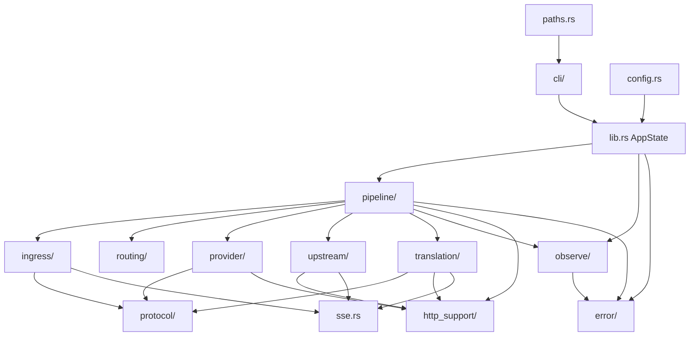

import { FileTree } from '@astrojs/starlight/components';
import { FeatureGrid, ModuleGrid, PipelineStageCards, ProxaiCallout } from '@components/ProxaiDocs.jsx';
import { FlowDiagram } from '@components/FlowDiagram.jsx';

export const proxyFlowNodes = [
  { id: 'client', position: { x: 0, y: 120 }, data: { label: '客户端 HTTP 请求' } },
  { id: 'ingress', position: { x: 230, y: 40 }, data: { label: 'ingress\n解析 + 归一化' } },
  { id: 'routing', position: { x: 460, y: 40 }, data: { label: 'routing\nroute + provider' } },
  { id: 'requestTranslation', position: { x: 690, y: 40 }, data: { label: 'translation\n请求 payload' } },
  { id: 'providerRequest', position: { x: 920, y: 40 }, data: { label: 'provider/request\n模型改写 + 序列化' } },
  { id: 'transport', position: { x: 920, y: 200 }, data: { label: 'provider/transport\n发送上游' } },
  { id: 'upstream', position: { x: 690, y: 200 }, data: { label: 'upstream\n读取响应' } },
  { id: 'responseTranslation', position: { x: 460, y: 200 }, data: { label: 'translation\n响应或流' } },
  { id: 'httpSupport', position: { x: 230, y: 200 }, data: { label: 'http_support\n重建响应' } },
  { id: 'response', position: { x: 0, y: 200 }, data: { label: '客户端 HTTP 响应' } },
];

export const proxyFlowEdges = [
  { id: 'e1', source: 'client', target: 'ingress', animated: true },
  { id: 'e2', source: 'ingress', target: 'routing', animated: true },
  { id: 'e3', source: 'routing', target: 'requestTranslation', animated: true },
  { id: 'e4', source: 'requestTranslation', target: 'providerRequest', animated: true },
  { id: 'e5', source: 'providerRequest', target: 'transport', animated: true },
  { id: 'e6', source: 'transport', target: 'upstream', animated: true },
  { id: 'e7', source: 'upstream', target: 'responseTranslation', animated: true },
  { id: 'e8', source: 'responseTranslation', target: 'httpSupport', animated: true },
  { id: 'e9', source: 'httpSupport', target: 'response', animated: true },
];

# 架构

ProxAI 是一个小型本地兼容代理：接收本地 OpenAI 兼容或 Anthropic 风格请求，做协议归一化与必要的跨协议翻译，然后转发到配置好的上游 provider，再把上游响应翻译回客户端期望的协议形态。

<ProxaiCallout type="tip" title="保持聚焦">
  ProxAI 应保持聚焦：本地兼容代理、显式 provider/protocol 路由、紧凑诊断、最少意外。除非明确要求，否则不要把它扩展成通用多租户 AI 网关。
</ProxaiCallout>


## 相关文档

<FeatureGrid
  items={[
    { title: '请求生命周期', href: '/zh/developer/architecture/request-lifecycle', icon: 'flow', description: '从入站请求、provider transport 到出站响应的源码级路径。' },
    { title: '模块边界', href: '/zh/developer/architecture/module-boundaries', icon: 'architecture', description: '解析、路由、转换、provider 行为、HTTP carrier、错误和观测分别应该放在哪里。' },
    { title: '配置流程', href: '/zh/developer/architecture/config-flow', icon: 'config', description: 'config.toml、示例、CLI overrides、校验、providers 与运行时状态如何组合。' },
    { title: '错误流程', href: '/zh/developer/architecture/error-flow', icon: 'alert', description: '内部错误如何变成紧凑的客户端 HTTP 和 SSE 错误。' },
    { title: '配置说明', href: '/zh/using/configuration', icon: 'config', description: '运行时设置、routes、providers、capture、logging 与 errors。' },
    { title: '协议总览', href: '/zh/protocol', icon: 'protocol', description: '阶段轴、协议轴和当前支持的运行时路径。' },
    { title: '协议转换', href: '/zh/developer/protocol-conversion', icon: 'flow', description: '面向协议 pair 的转换规则与协议类型对齐要求。' },
  ]}
/>


## 两轴模型

理解整个仓库前，先建立两条独立的轴。

### Phase 轴

Phase 轴描述数据在代理链路里的位置：

- `inbound_request` —— 客户端发给 ProxAI 的原始请求
- `provider_request` —— ProxAI 准备发给上游 provider 的请求
- `upstream_response` —— 上游 provider 返回给 ProxAI 的响应
- `outbound_response` —— ProxAI 返回给客户端的响应

### Protocol 轴

Protocol 轴描述某个 phase 使用的线上协议：

- `openai_responses`
- `openai_chat_completions`
- `anthropic_messages`

每个 phase 都有自己的 protocol：

- `inbound_request.protocol` = 客户端发的是什么
- `provider_request.protocol` = ProxAI 发上游用的是什么，由选中 provider 的 `protocol` 决定
- `upstream_response.protocol` = provider 返回的是什么
- `outbound_response.protocol` = ProxAI 返回给客户端的是什么

Provider 名字只是用户标签，不是语义协议标识。

## 顶层源码结构

<FileTree>

- src/
  - main.rs — 入口，仅转调 `cli::main`
  - lib.rs — `AppState`、axum `Router`、proxy handler
  - cli/ — 命令行解析与启动流程
  - config.rs — `config.toml` schema 与加载
  - paths.rs — 应用目录解析
  - request.rs — 共享请求载体类型
  - sse.rs — SSE 基础工具
  - formatting.rs — 通用格式化工具
  - error/ — 领域错误类型与渲染
  - http_support/ — HTTP 载体工具
  - ingress/ — 入站协议解析与归一化
  - protocol/ — 各协议 wire 类型与协议枚举
  - routing/ — 路由匹配
  - provider/ — provider 请求构造与 HTTP transport
  - upstream/ — 上游响应读回
  - translation/ — 跨协议转换
  - pipeline/ — 类型化代理 pipeline
  - observe/ — 捕获、日志、诊断
  - mcp/ — MCP 控制面

</FileTree>

## 请求生命周期

`src/lib.rs` 注册这些路由，并统一进入同一个 `proxy` handler：

```text
/v1/responses          /responses
/v1/chat/completions   /chat/completions
/v1/messages           /messages
```

入站侧简化流程：

```rust
let prepared_provider = inbound_http
    .prepare_inbound()?                  // ingress: 解析 + 归一化
    .route_to_provider(...)?             // routing: 选择 provider
    .prepare_provider_request()?;        // provider/request + translation

run_provider_flow(prepared_provider).await
```

`run_provider_flow` 串联 provider 侧流程：

```rust
let provider_http = prepared_provider
    .send_to_upstream().await?           // provider/transport + upstream
    .handle_upstream_response().await?;  // upstream: 读取 body / stream

provider_http.translate_to_outbound().await?  // translation + http_support
```

<FlowDiagram nodes={proxyFlowNodes} edges={proxyFlowEdges} height={420} client:only="react" />

## Pipeline 阶段

<PipelineStageCards
  labels={{ modules: '主要模块', responsibility: '职责' }}
  stages={[
    {
      name: 'inbound_request',
      modules: ['pipeline/inbound.rs', 'ingress/'],
      responsibility: '读取 body、检测协议、归一化请求形态、构造 `InboundHttpFlow`。',
    },
    {
      name: '路由',
      codeName: false,
      modules: ['pipeline/inbound.rs', 'routing/'],
      responsibility: '按协议和模型匹配 route，解析默认 provider。',
    },
    {
      name: 'provider_request',
      modules: ['pipeline/provider_request.rs', 'provider/request', 'translation/request'],
      responsibility: '转换请求 payload、provider 模型重写、body 序列化。',
    },
    {
      name: '发送上游',
      codeName: false,
      modules: ['pipeline/provider_request.rs', 'provider/transport'],
      responsibility: '构造认证 header、拼接上游 URL、通过 `reqwest` 发送。',
    },
    {
      name: 'upstream_response',
      modules: ['pipeline/upstream_response.rs', 'upstream/'],
      responsibility: '读取状态码、header、非流式 body 或流式 body。',
    },
    {
      name: 'outbound_response',
      modules: ['pipeline/provider_response.rs', 'translation/response', 'translation/streaming'],
      responsibility: '将响应翻译回入站协议并重建 HTTP 响应。',
    },
  ]}
/>

`pipeline/` 使用类型状态 `ProxyFlow<S>` 串联阶段。每个阶段消费当前 flow state 并返回下一个 state，使阶段顺序显式化。

## 模块职责地图

<ModuleGrid
  modules={[
    { name: 'protocol/', icon: 'protocol', description: '协议 wire shape 与共享协议枚举。只建模 JSON，不做转换，不依赖 HTTP 载体。' },
    { name: 'ingress/', icon: 'route', description: '入站协议检测、解析与归一化，发生在 routing 和 translation 之前。' },
    { name: 'routing/', icon: 'flow', description: '根据请求协议、模型模式、默认值和 route 配置选择 provider。' },
    { name: 'translation/', icon: 'protocol', description: '在显式协议 pair 之间做纯请求、响应与流式转换。' },
    { name: 'provider/', icon: 'key', description: 'Provider 请求渲染、模型改写、认证 header、上游 URL 构造和 transport。' },
    { name: 'upstream/', icon: 'terminal', description: '读取上游状态码、headers、完整 body 或流式 byte carrier。' },
    { name: 'http_support/', icon: 'file', description: '协议无关的 HTTP 工具，例如 content-type 检测、响应重建和 boxed stream。' },
    { name: 'observe/', icon: 'gauge', description: 'Capture artifact、结构化日志、request hints 和隐私友好的诊断。' },
    { name: 'error/', icon: 'alert', description: '领域错误类型与面向客户端的响应渲染。' },
  ]}
/>

## 边界规则

- `protocol/` 是底层 wire 建模：只描述 JSON shape，不做转换。
- `pipeline/` 协调完整请求生命周期，并保持 phase 顺序显式。
- `translation/` 在 HTTP 载体边界保持纯粹：接收 protocol 值和 payload/stream carrier，不接收 HTTP `Response`/`Body` 或 provider 私有结构。
- `provider/` 负责 provider 请求渲染和 transport 细节，例如认证 header、上游 URL 和 idle-read timeout。
- `observe/` 横切 pipeline 做诊断，但不参与 routing 或 protocol 决策。
- 语义层 stream/HTTP 错误应使用领域错误，不要隐藏进 `std::io::Error`。

## 依赖方向



关键规则：

- `protocol/` 是底层 wire 建模。
- `pipeline/` 是知道完整请求生命周期的协调者。
- `translation/` 不依赖 HTTP `Response`/`Body` 或 provider 私有类型。
- `observe/` 横切 pipeline，但不参与协议或路由决策。

## 翻译路径选择

翻译路径由两个 protocol 值决定：

- `ingress/` 检测出的 inbound `request_protocol`
- 选中 provider 配置的 `protocol`

规则：

- 协议相同：不做协议转换，直接通过。
- 协议不同：进入 `translation/<inbound_protocol>/to_<provider_protocol>/`。
- 未实现的协议对显式失败。

## 数据类型约定

- 协议特定请求/响应数据优先用按 protocol 区分的顶层 enum 包装。
- 避免平行 `protocol` / `payload` / `projection` / `summary` 字段漂移成不可能状态。
- 流跨过 HTTP 载体边界后保持为 `ByteStream`。
- provider 名字与 protocol 名字保持分离。
