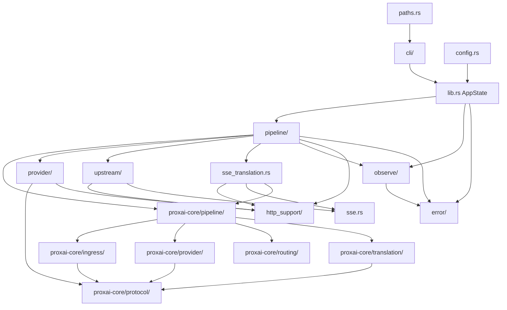

import { FileTree } from '@astrojs/starlight/components';
import { FeatureGrid, ModuleGrid, PipelineStageCards, ProxaiCallout } from '@components/ProxaiDocs.jsx';
import { FlowDiagram } from '@components/FlowDiagram.jsx';

export const proxyFlowNodes = [
  { id: 'client', position: { x: 0, y: 120 }, data: { label: '客户端 HTTP 请求' } },
  { id: 'ingress', position: { x: 230, y: 40 }, data: { label: 'ingress\n解析 + 归一化' } },
  { id: 'routing', position: { x: 460, y: 40 }, data: { label: 'routing\nroute + provider' } },
  { id: 'requestTranslation', position: { x: 690, y: 40 }, data: { label: 'translation\n请求 payload' } },
  { id: 'providerRequest', position: { x: 920, y: 40 }, data: { label: 'provider request\n适配 + 序列化' } },
  { id: 'transport', position: { x: 920, y: 200 }, data: { label: 'provider/transport\n发送上游' } },
  { id: 'upstream', position: { x: 690, y: 200 }, data: { label: 'upstream\n读取响应' } },
  { id: 'responseTranslation', position: { x: 460, y: 200 }, data: { label: 'translation\n响应或流' } },
  { id: 'httpSupport', position: { x: 230, y: 200 }, data: { label: 'http_support\n重建响应' } },
  { id: 'response', position: { x: 0, y: 200 }, data: { label: '客户端 HTTP 响应' } },
];

export const proxyFlowEdges = [
  { id: 'e1', source: 'client', target: 'ingress', animated: true },
  { id: 'e2', source: 'ingress', target: 'routing', animated: true },
  { id: 'e3', source: 'routing', target: 'requestTranslation', animated: true },
  { id: 'e4', source: 'requestTranslation', target: 'providerRequest', animated: true },
  { id: 'e5', source: 'providerRequest', target: 'transport', animated: true },
  { id: 'e6', source: 'transport', target: 'upstream', animated: true },
  { id: 'e7', source: 'upstream', target: 'responseTranslation', animated: true },
  { id: 'e8', source: 'responseTranslation', target: 'httpSupport', animated: true },
  { id: 'e9', source: 'httpSupport', target: 'response', animated: true },
];

# 架构

ProxAI 是一个小型本地兼容代理：接收本地 OpenAI 兼容或 Anthropic 风格请求，做协议归一化与必要的跨协议翻译，然后转发到配置好的上游 provider，再把上游响应翻译回客户端期望的协议形态。

<ProxaiCallout type="tip" title="保持聚焦">
  ProxAI 应保持聚焦：本地兼容代理、显式 provider/protocol 路由、紧凑诊断、最少意外。除非明确要求，否则不要把它扩展成通用多租户 AI 网关。
</ProxaiCallout>


## 相关文档

<FeatureGrid
  items={[
    { title: '请求生命周期', href: '/zh/developer/architecture/request-lifecycle', icon: 'flow', description: '从入站请求、provider transport 到出站响应的源码级路径。' },
    { title: '模块边界', href: '/zh/developer/architecture/module-boundaries', icon: 'architecture', description: '解析、路由、转换、provider 行为、HTTP carrier、错误和观测分别应该放在哪里。' },
    { title: '配置流程', href: '/zh/developer/architecture/config-flow', icon: 'config', description: 'config.toml、示例、CLI overrides、校验、providers 与运行时状态如何组合。' },
    { title: '错误流程', href: '/zh/developer/architecture/error-flow', icon: 'alert', description: '内部错误如何变成紧凑的客户端 HTTP 和 SSE 错误。' },
    { title: '配置说明', href: '/zh/using/configuration', icon: 'config', description: '运行时设置、routes、providers、capture、logging 与 errors。' },
    { title: '协议总览', href: '/zh/protocol', icon: 'protocol', description: '阶段轴、协议轴和当前支持的运行时路径。' },
    { title: '协议转换', href: '/zh/developer/protocol-conversion', icon: 'flow', description: '面向协议 pair 的转换规则与协议类型对齐要求。' },
  ]}
/>


## 两轴模型

理解整个仓库前，先建立两条独立的轴。

### Phase 轴

Phase 轴描述数据在代理链路里的位置：

- `inbound_request` —— 客户端发给 ProxAI 的原始请求
- `provider_request` —— ProxAI 准备发给上游 provider 的请求
- `upstream_response` —— 上游 provider 返回给 ProxAI 的响应
- `outbound_response` —— ProxAI 返回给客户端的响应

### Protocol 轴

Protocol 轴描述某个 phase 使用的线上协议：

- `openai_responses`
- `openai_chat_completions`
- `anthropic_messages`

每个 phase 都有自己的 protocol：

- `inbound_request.protocol` = 客户端发的是什么
- `provider_request.protocol` = ProxAI 发上游用的是什么，由选中 provider 的 `protocol` 决定
- `upstream_response.protocol` = provider 返回的是什么
- `outbound_response.protocol` = ProxAI 返回给客户端的是什么

Provider 名字只是用户标签，不是语义协议标识。

## 顶层源码结构

<FileTree>

- src/
  - main.rs — 入口，仅转调 `cli::main`
  - lib.rs — `AppState`、axum `Router`、proxy handler
  - cli/ — 命令行解析与启动流程
  - config.rs — `config.toml` schema 与加载
  - paths.rs — 应用目录解析
  - request.rs — 共享请求载体类型
  - sse.rs — SSE 解析与编码基础工具
  - sse_translation.rs — SSE bytes 与结构化 translation events 之间的应用层适配器
  - formatting.rs — 通用格式化工具
  - error/ — 领域错误类型与渲染
  - http_support/ — HTTP 载体工具
  - provider/ — provider request projection/序列化、响应观测与 HTTP transport
  - upstream/ — 上游响应读回
  - pipeline/ — 类型化代理 pipeline，包含 HTTP ingress 适配
  - observe/ — 捕获、日志、诊断
  - mcp/ — MCP 控制面
- crates/
  - proxai-core/
    - src/
      - ingress/ — 与 carrier 无关的入站归一化与校验
      - pipeline/ — 组合 ingress、routing、translation 与 provider adaptation 的 carrier-independent façade
      - protocol/ — 各协议 wire 类型与协议枚举
      - routing/ — 编译后的协议/模型路由与 provider 标签选择
      - provider/ — 与 carrier 无关的 provider request preparation 与响应/错误归一化
      - translation/ — 与 carrier 无关的跨协议转换

</FileTree>

HTTP ingress、provider projection/序列化、transport lookup 和 SSE carrier adaptation 留在 `src/`。`proxai-core::pipeline` 把结构化 ingress、provider 标签路由、provider request/response adaptation 与 translation 组合成可复用的 `Value`/`StreamEvent` façade。

## 请求生命周期

`src/lib.rs` 注册这些路由，并统一进入同一个 `proxy` handler：

```text
/v1/responses          /responses
/v1/chat/completions   /chat/completions
/v1/messages           /messages
```

入站侧简化流程：

```rust
let prepared_provider = inbound_http
    .parse_inbound()?                    // 应用：path + JSON bytes
    .prepare_provider_request(           // core：ingress + route + translate + adapt
        &state.core_pipeline,
        &state.providers,
    )?;

run_provider_flow(prepared_provider).await
```

`run_provider_flow` 串联 provider 侧流程：

```rust
let provider_http = prepared_provider
    .send_to_upstream().await?           // provider/transport + upstream
    .handle_upstream_response().await?;  // upstream: 读取 body / stream

provider_http.translate_to_outbound().await?  // translation + http_support
```

<FlowDiagram nodes={proxyFlowNodes} edges={proxyFlowEdges} height={420} client:only="react" />

## Pipeline 阶段

<PipelineStageCards
  labels={{ modules: '主要模块', responsibility: '职责' }}
  stages={[
    {
      name: 'inbound_request',
      modules: ['src/pipeline/inbound.rs', 'proxai-core/pipeline/', 'proxai-core/ingress/'],
      responsibility: '应用层读取 body bytes、检测协议并解析 JSON；core pipeline 归一化和校验结构化请求。',
    },
    {
      name: '路由',
      codeName: false,
      modules: ['pipeline/provider_request.rs', 'proxai-core/pipeline/', 'proxai-core/routing/'],
      responsibility: 'Core 解析 provider 标签、协议、compatibility policy 与 upstream model，再选择应用层 transport。',
    },
    {
      name: 'provider_request',
      modules: ['pipeline/provider_request.rs', 'proxai-core/pipeline/', 'proxai-core/translation/request', 'proxai-core/provider/request', 'provider/request'],
      responsibility: 'Core 返回准备好的 provider value 和匹配的 response pipeline，再由应用层提取诊断 projection 并序列化 body。',
    },
    {
      name: '发送上游',
      codeName: false,
      modules: ['pipeline/provider_request.rs', 'provider/transport'],
      responsibility: '构造认证 header、拼接上游 URL、通过 `reqwest` 发送。',
    },
    {
      name: 'upstream_response',
      modules: ['pipeline/upstream_response.rs', 'upstream/'],
      responsibility: '读取状态码、header、非流式 body 或流式 body。',
    },
    {
      name: 'outbound_response',
      modules: ['pipeline/provider_response.rs', 'sse_translation.rs', 'proxai-core/pipeline/', 'proxai-core/translation/response', 'proxai-core/translation/stream'],
      responsibility: '通过 `ResponsePipeline` 执行结构化响应 normalization 与 translation，在事件和 SSE bytes 之间适配、观测失败并重建 HTTP。',
    },
  ]}
/>

`pipeline/` 使用类型状态 `ProxyFlow<S>` 串联阶段。每个阶段消费当前 flow state 并返回下一个 state，使阶段顺序显式化。

## 模块职责地图

<ModuleGrid
  modules={[
    { name: 'proxai-core/protocol/', icon: 'protocol', description: 'Core crate 的协议 wire shape 与共享协议枚举。只建模 JSON，不做转换，不依赖 HTTP 载体。' },
    { name: 'src/pipeline/inbound.rs', icon: 'route', description: 'HTTP path 检测、JSON bytes 解析，以及结构化 core preparation 前的 carrier 错误映射。' },
    { name: 'proxai-core/ingress/', icon: 'route', description: '与 carrier 无关的结构化请求归一化、校验、模型提取和类型化 ingress observations。' },
    { name: 'proxai-core/pipeline/', icon: 'flow', description: '组合 ingress、routing、request preparation、response normalization 与 translation 的可复用结构化 façade。' },
    { name: 'proxai-core/observe/', icon: 'gauge', description: '共享 `Observer` contract、封闭的 `Observation` variants 和 no-op 默认实现；不包含具体 sink。' },
    { name: 'proxai-core/routing/', icon: 'flow', description: '根据请求协议、模型模式、默认值和 route 配置选择 provider 标签，不依赖 carrier。' },
    { name: 'proxai-core/provider/', icon: 'key', description: '与 carrier 无关的 provider request value preparation、响应 compatibility policy、结构化 response/event 与 error-payload normalization 和类型化 adaptation observations。' },
    { name: 'proxai-core/translation/', icon: 'protocol', description: 'Core crate 在显式协议 pair 之间做请求、响应与结构化事件转换，暴露 `Translator` façade，并通过共享 `Observer` 发出类型化 observations。' },
    { name: 'provider/', icon: 'key', description: 'Provider projection/summary 提取、request 序列化、响应观测、认证 header、上游 URL 构造和 transport。' },
    { name: 'upstream/', icon: 'terminal', description: '读取上游状态码、headers、完整 body 或流式 byte carrier。' },
    { name: 'sse_translation.rs', icon: 'flow', description: '应用层 carrier 适配器：把 SSE bytes 解析成 `StreamTranslationInput`，调用 core `ResponsePipeline`，保留原始失败现场，再编码回 SSE。' },
    { name: 'http_support/', icon: 'file', description: '协议无关的 HTTP 工具，例如 content-type 检测、响应重建和 boxed byte stream。' },
    { name: 'observe/', icon: 'gauge', description: 'Capture artifact、结构化日志、request hints 和隐私友好的诊断。' },
    { name: 'error/', icon: 'alert', description: '领域错误类型与面向客户端的响应渲染。' },
  ]}
/>

## 边界规则

- `proxai-core/protocol/` 是底层 wire 建模：只描述 JSON shape，不做转换。
- `proxai-core/ingress/` 接收结构化 JSON value，负责协议归一化和校验，绝不接收 HTTP body bytes。
- `src/pipeline/inbound.rs` 是负责 path 检测和 JSON bytes 解析的应用 adapter。
- `proxai-core/pipeline/` 组合完整结构化 request/response 路径并绑定 request-scoped core observer，但不拥有 transport。
- `src/pipeline/` 围绕 core façade 协调 HTTP carrier 与 transport，并保持 phase 顺序显式。
- `proxai-core/provider/` 负责与 carrier 无关的 provider request value preparation、响应 compatibility policy、结构化 response/event 与 error-payload normalization 和类型化 adaptation observations。
- `proxai-core/translation/` 与 carrier 无关：`Translator` 只接收 JSON `Value` 或结构化 `StreamEvent`，不接收 HTTP response/body、SSE bytes 或 provider 私有结构。
- `sse_translation.rs` 是 upstream byte stream 与 core provider/translation API 之间的应用层适配器，负责保留触发失败的原始 frame 和 SSE 输出编码。
- `provider/` 负责应用侧 provider projection/summary、request 序列化、响应观测和 transport 细节，例如认证 header、上游 URL 和 idle-read timeout。
- `proxai-core/observe/` 定义共享 `Observer` contract 和封闭的 `Observation` enum。Core ingress、provider normalization 与 translation 发出类型化 variants；`src/observe/` 提供下游实现，并负责日志、诊断和 capture。
- `observe/` 横切 pipeline 做诊断，但不参与 routing 或 protocol 决策。
- 语义层 stream/HTTP 错误应使用领域错误，不要隐藏进 `std::io::Error`。

## 依赖方向


```mermaid
flowchart TD
  cli[cli/] --> lib[lib.rs AppState]
  config[config.rs] --> lib
  paths[paths.rs] --> cli
  lib --> pipeline[pipeline/]

  pipeline --> core_pipeline[proxai-core/pipeline/]
  core_pipeline --> core_ingress[proxai-core/ingress/]
  core_pipeline --> core_provider[proxai-core/provider/]
  core_pipeline --> routing[proxai-core/routing/]
  pipeline --> provider[provider/]
  pipeline --> upstream[upstream/]
  pipeline --> sse_translation[sse_translation.rs]
  core_pipeline --> translation[proxai-core/translation/]
  pipeline --> observe[observe/]
  pipeline --> http_support[http_support/]
  pipeline --> error[error/]

  core_ingress --> protocol[proxai-core/protocol/]
  core_provider --> protocol
  translation --> protocol
  provider --> protocol
  upstream --> http_support
  provider --> http_support
  sse_translation --> http_support
  sse_translation --> sse[sse.rs]
  sse_translation --> core_pipeline
  upstream --> sse
  observe --> error
  lib --> observe
  lib --> error
```

关键规则：

- `proxai-core/protocol/` 是底层 wire 建模。
- `proxai-core/ingress/` 是入站归一化与校验的结构化 value 边界；`src/pipeline/inbound.rs` 适配 HTTP bytes 和应用诊断。
- `proxai-core/provider/` 是 provider 响应 compatibility 的结构化边界。
- `proxai-core/pipeline/` 是 carrier-independent composition root；`src/pipeline/` 协调 HTTP 生命周期并把选中的 provider 标签映射到 transport。
- `proxai-core/translation/` 只依赖协议模型、结构化 value/event 和 core observation contract，不依赖 HTTP、SSE bytes、provider transport 或具体应用观测实现。
- `sse_translation.rs` 把 byte carrier 适配到 core `ResponsePipeline`；应用 pipeline 负责诊断和客户端错误渲染。
- `observe/` 实现核心 observation trait，但不参与协议或路由决策。

## 翻译路径选择

`Translator` 根据两个 protocol 值选择翻译路径：

- `pipeline/inbound.rs` 检测出的 inbound `request_protocol`
- 选中 provider 配置的 `protocol`

规则：

- 协议相同：不做协议转换，直接通过。
- 协议不同：进入 `crates/proxai-core/src/translation/<inbound_protocol>/to_<provider_protocol>/`。
- 未实现的协议对显式失败。

`Translator` 是唯一公开的 façade，直接持有所选 route 与 observation hook。每个入口会派生一个绑定 phase 的 `TranslationScope`：request、non-streaming response 或 streaming response。Pair code 因此无需在 observation 调用中单独传 phase，也就不可能把一次操作的遥测误记到其他 pipeline phase。Value translation 借用派生出的 scope；structured stream translation 消费 `Translator`，把 streaming-response scope 移入返回的 stream，并在其中惰性创建私有、封闭的 `PairStreamingState`，其恰好包含六种跨协议状态机之一，或 identity 路径。这样 value-only translation 不会分配无用流状态，同时 pair state 也不可能被跨 stream 复用。TranslationRoute 与 TranslationScope 定义位于 façade 下层的 `translation/context.rs`；顶层分发和 pair code 只接收 `&TranslationScope`，因此 dispatch、phase 与 observation 不可能对当前操作产生分歧。协议无关的 event、error、terminal、identity 与 lifecycle 类型集中在无外部依赖的 `translation/stream.rs`。Pair 只依赖 `context.rs` 与 `stream.rs`，`Translator` 再依赖这些底层和 pair state，所有依赖边保持单向。Carrier adapter 只调用 `Translator::translate_stream`，不再直接驱动 pair event 或 terminal handling。

## 数据类型约定

- 协议特定请求/响应数据优先用按 protocol 区分的顶层 enum 包装。
- 避免平行 `protocol` / `payload` / `projection` / `summary` 字段漂移成不可能状态。
- 核心 streaming API 保持 `StreamEvent` in/out；`ByteStream` 只存在于应用 carrier 层。
- provider 名字与 protocol 名字保持分离。
